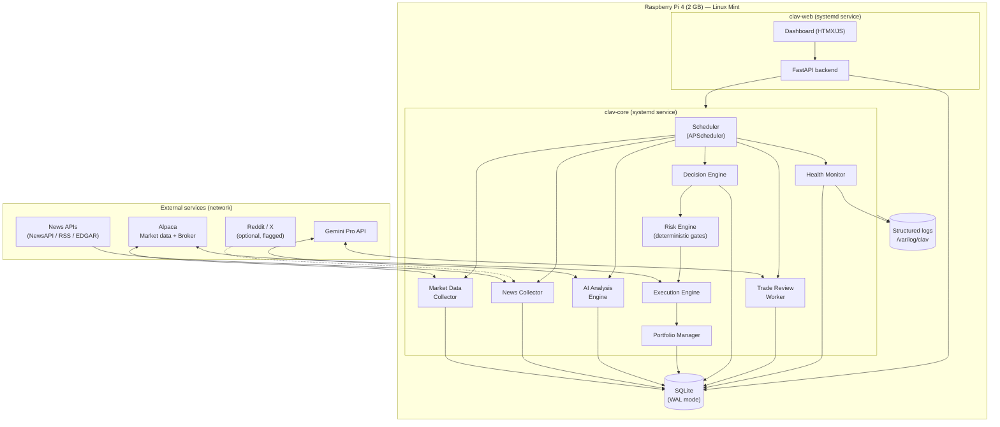
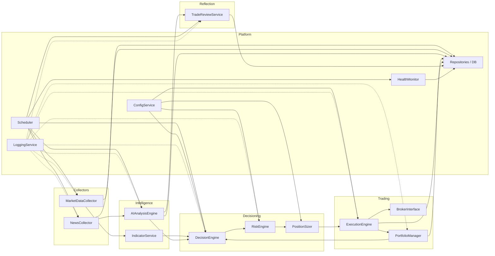
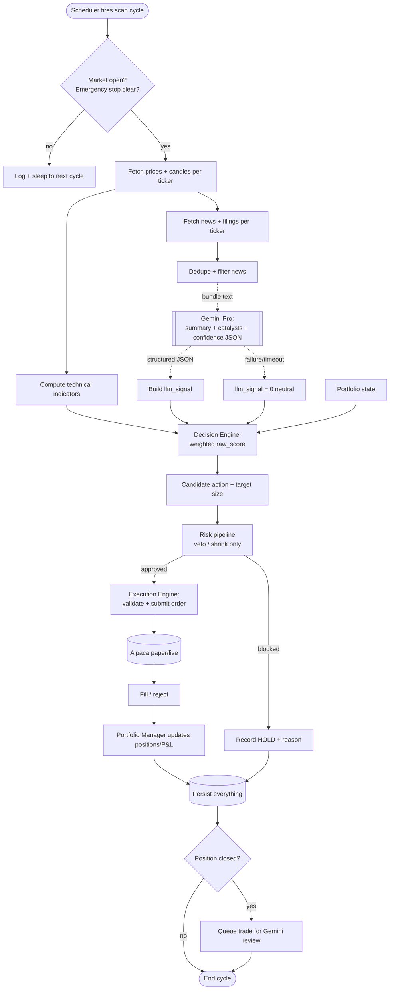

# 01 — System Architecture

## 1. Overall architecture

CLAV is a single-process-per-role monolith-of-services running on one Raspberry Pi. Roles
communicate through the SQLite database and an in-process event/scheduler layer rather than
a network message bus (kept deliberately simple for a 2 GB device; a bus is a documented
future step). The dashboard runs as a separate lightweight process so a UI crash can never
take down trading.



### Process topology
- **`clav-core`** — the trading brain. One Python process, single scheduler, modules called
  as in-process components. Restarted by systemd on crash.
- **`clav-web`** — FastAPI + a minimal server-rendered dashboard. Read-mostly; the few write
  actions (pause/stop/override) go through a guarded control API into `clav-core` via a
  small local IPC (a control table in SQLite polled by core, or a Unix socket).
- **SQLite** — the shared source of truth, opened in WAL mode so the reader (web) never
  blocks the writer (core).

## 2. Module diagram



Each module depends on **interfaces**, not concretions (see
[05 — Class Design](05-class-design.md)). This is what makes brokers, data sources, and the
LLM swappable.

## 3. Data-flow diagram

The canonical scan cycle. Deterministic stages are solid; the single LLM hop is dashed to
emphasize it is advisory and failure-tolerant.



### Why this shape
- **News/LLM runs in parallel** with indicator computation, so LLM latency does not stall
  price collection.
- **The LLM feeds scoring, never execution.** There is no arrow from the LLM to the broker.
- **Risk is a mandatory choke point** between decision and execution — a single place to
  audit and test every safety rule.
- **Review is asynchronous**, off the hot path, so reflection never delays trading.

## 4. Layering

```
┌──────────────────────────────────────────────┐
│ Presentation   dashboard (FastAPI + HTMX)     │
├──────────────────────────────────────────────┤
│ Orchestration  scheduler, scan-cycle service  │
├──────────────────────────────────────────────┤
│ Domain         decision, risk, sizing,        │
│                portfolio, review              │
├──────────────────────────────────────────────┤
│ Integration    broker, market data, news,     │
│                Gemini clients (adapters)      │
├──────────────────────────────────────────────┤
│ Platform       config, logging, repositories, │
│                SQLite, health                 │
└──────────────────────────────────────────────┘
```

Dependencies point **downward only**. The domain layer knows nothing about Alpaca or
Gemini — it talks to `Broker`, `MarketDataSource`, `NewsSource`, and `Analyst` interfaces.
This is the single most important rule for keeping CLAV modular and testable.
