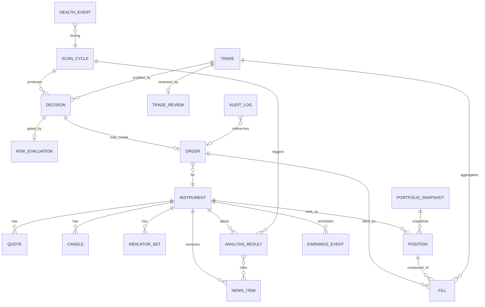

# 03 — Database Design

## 1. SQLite vs PostgreSQL — recommendation

**Use SQLite (WAL mode) for CLAV.** Rationale for this hardware and workload:

| Factor | SQLite | PostgreSQL | Verdict |
|--------|--------|------------|---------|
| RAM footprint | ~a few MB, in-process | 100–200 MB+ server | SQLite wins hard on a 2 GB Pi |
| Admin overhead | Zero (a file) | Users, tuning, backups, service | SQLite |
| Concurrency | 1 writer + N readers (WAL) | Many writers | CLAV has **one writer** (core) — fine |
| Write volume | Thousands/day easily | Millions/s | CLAV writes are tiny/low-rate |
| Backup | Copy one file | pg_dump/replication | SQLite |
| Migration path | → Postgres later via SQLAlchemy | — | Keep the door open |

CLAV's workload is a **single-writer, low-throughput, read-mostly** system. SQLite in WAL
mode gives the web process consistent reads without blocking the trading writer. Use
SQLAlchemy Core/ORM so a future move to Postgres (needed only if you go multi-node or
multi-writer) is a connection-string change plus migration review, not a rewrite.

**SQLite operational settings:**
```sql
PRAGMA journal_mode = WAL;      -- readers don't block the writer
PRAGMA synchronous = NORMAL;    -- safe with WAL, fewer fsyncs (kind to SD cards)
PRAGMA busy_timeout = 5000;     -- wait rather than error on brief locks
PRAGMA foreign_keys = ON;
```
Put the DB file on the **SSD/USB drive, not the SD card** (see [09 — Deployment](09-deployment.md)).

## 2. Entity-relationship diagram



## 3. Table catalog

### Reference & market data
- **instrument** — `id, symbol, name, exchange, sector, industry, asset_class, is_active`.
- **quote** — `id, instrument_id, price, bid, ask, volume, ts, is_stale`.
- **candle** — `id, instrument_id, timeframe, open, high, low, close, volume, ts`
  (unique on `instrument_id, timeframe, ts`).
- **indicator_set** — `id, instrument_id, ts, sma_20, ema_50, rsi_14, macd, macd_signal,
  atr_14, bb_upper, bb_lower, vol_avg_20, technical_score` (denormalized snapshot per cycle).
- **earnings_event** — `id, instrument_id, event_type, scheduled_at, confirmed, source`.

### Qualitative & AI
- **news_item** — `id, instrument_id, source, url, headline, body, content_hash,
  published_at, fetched_at, sentiment_hint` (unique on `content_hash`).
- **analysis_result** — `id, instrument_id, scan_cycle_id, model, summary, sentiment,
  sentiment_shift, confidence, source_agreement, bullish_catalysts(json),
  bearish_catalysts(json), key_risks(json), rationale, raw_response(json), tokens_used,
  created_at`.
- **analysis_news_link** — `analysis_result_id, news_item_id` (M:N provenance: which stories
  fed which analysis).

### Decision & execution
- **scan_cycle** — `id, started_at, finished_at, mode(paper|live|dryrun), market_open,
  trigger(scheduled|manual), status`.
- **decision** — `id, scan_cycle_id, instrument_id, action(BUY|SELL|HOLD), raw_score,
  technical_score, llm_signal, portfolio_bias, target_qty, reasoning(json), created_at`.
- **risk_evaluation** — `id, decision_id, approved, adjusted_qty, blocked_by(json),
  notes(json), evaluated_at` (records *why* a trade was allowed/shrunk/vetoed — critical for
  audits).
- **order** — `id, decision_id, instrument_id, client_order_id(unique), broker_order_id,
  side, type, qty, limit_price, status, submitted_at, updated_at, error`.
- **fill** — `id, order_id, qty, price, fee, filled_at, broker_fill_id`.
- **trade** — `id, instrument_id, entry_order_id, exit_order_id, qty, entry_price,
  exit_price, opened_at, closed_at, realized_pl, return_pct, status(open|closed),
  entry_decision_id`.

### Portfolio & accounting
- **position** — `id, instrument_id, qty, avg_entry_price, opened_at, status, stop_price,
  take_profit_price` (current live positions).
- **portfolio_snapshot** — `id, ts, cash, equity, buying_power, unrealized_pl, realized_pl,
  gross_exposure, net_exposure, drawdown, peak_equity, sector_allocation(json), reconciled`.

### Reflection, ops, control
- **trade_review** — `id, trade_id, model, why_entered, supporting_info, risks_at_entry,
  reasoning_correct(bool/nullable), misleading_signals, improvements, raw_response(json),
  created_at`.
- **health_event** — `id, ts, type, severity(info|warn|critical), message, context(json)`.
- **audit_log** — `id, ts, actor(system|user), action, entity_type, entity_id,
  before(json), after(json), correlation_id` (every state change and manual override).
- **system_control** — `id, key, value, updated_at, updated_by` — a tiny K/V table the web
  process writes and core polls: `emergency_stop`, `paused`, `mode`, `manual_overrides`.
- **config_snapshot** — `id, ts, config(json), git_sha` — captures the effective config at
  each cycle so historical decisions are reproducible.

## 4. Key relationships & integrity

- **Provenance chain (auditability backbone):**
  `news_item → analysis_result → decision → risk_evaluation → order → fill → trade →
  trade_review`. Any closed trade can be walked back to the exact headlines and numbers that
  produced it.
- **Idempotency:** `order.client_order_id` is UNIQUE; `news_item.content_hash` is UNIQUE.
  These two constraints are what prevent duplicate orders and duplicate LLM billing.
- **Immutability:** `decision`, `risk_evaluation`, `analysis_result`, `fill`, and
  `audit_log` are **append-only** (no UPDATE/DELETE in normal operation). Mutable state
  lives only in `position`, `portfolio_snapshot`, `order.status`, and `system_control`.
- **Time:** store all timestamps in UTC (`ts` as ISO-8601 / epoch); render local time only
  in the dashboard.

## 5. Retention & housekeeping
- `quote` and intraday `candle` rows are high-volume: keep raw quotes ~30–90 days, then
  down-sample/delete via a scheduled job. Daily candles and all decision/trade/review rows
  are kept indefinitely (they are the journal).
- Nightly `VACUUM`/`PRAGMA wal_checkpoint(TRUNCATE)` in the maintenance job to keep the file
  and WAL from bloating the SD/SSD.
- Indexes on every `(*_id, ts)` foreign-key pair used by the dashboard and scan cycle.

## 6. Migrations
Use **Alembic** from day one, even on SQLite. Schema changes ship as reviewed migration
scripts; this is also the mechanism for an eventual Postgres cutover.
