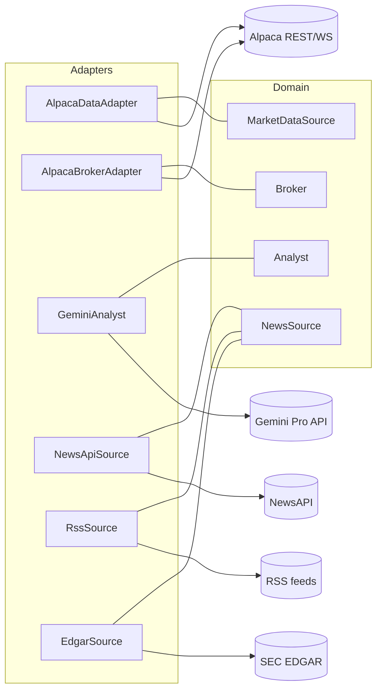
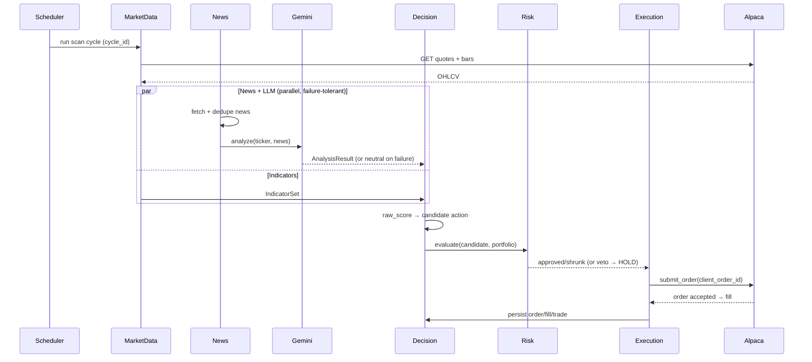

# 04 — External Integrations & API Interactions

All external calls go through **adapter classes** that implement platform interfaces. The
domain layer never imports `alpaca`, `google.generativeai`, `requests`, etc. This isolates
vendor churn and makes everything mockable in tests.



## 1. Alpaca (market data + broker)

- **SDK:** `alpaca-py`. Two credential sets in config: **paper** (default) and **live**.
- **Endpoints used:**
  - *Trading API* — account, positions, orders (submit/cancel/list), clock (market open),
    calendar.
  - *Market Data API* — latest quotes/trades, historical bars (IEX feed on the free tier;
    SIP if subscribed).
  - *Streaming (optional, later)* — WebSocket for trade updates so fills are learned via push
    rather than polling.
- **Order submission (idempotent):**
  ```python
  broker.submit_order(SubmitOrder(
      symbol="AAPL", qty=10, side="buy", type="market",
      time_in_force="day",
      client_order_id="clav-<cycle_id>-AAPL-buy",  # dedupe key
  ))
  ```
  Alpaca rejects a duplicate `client_order_id`, giving broker-enforced idempotency on top of
  CLAV's own DB uniqueness constraint.
- **Startup reconciliation:** on boot, `list_orders(status="open")` and `list_positions()`
  reconcile CLAV's DB against the broker before any new decision runs.
- **Rate limits & errors:** wrap all calls in a retry decorator (exponential backoff +
  jitter, capped attempts). Distinguish transient (5xx, timeout, 429) from permanent (4xx
  validation) — only transient errors retry.

## 2. Gemini Pro (analysis + review)

- **SDK:** `google-generativeai`. One API key in `.env`.
- **Calls:** `AIAnalysisEngine.analyze()` (per ticker with new news) and
  `TradeReviewService.review()` (per closed trade).
- **Structured output:** request JSON via response schema / `response_mime_type:
  application/json`; validate with **Pydantic**. One repair-retry on malformed output, then
  neutral fallback.
- **Guardrails:**
  - Timeout per call (e.g. 30 s); on timeout → neutral signal, `LLM_UNAVAILABLE` event.
  - **Token budget** tracked in `analysis_result.tokens_used`; a monthly cap in config
    pauses analysis when exceeded (system runs technical-only).
  - **No secrets or tools ever go to Gemini.** It receives only market/news text and returns
    text/JSON. It has no function-calling access to the broker.
  - Cache by `content_hash` set — identical news bundles are not re-billed.

### Example analysis request (conceptual)
```
System: You are a sell-side equity analyst. Output ONLY JSON matching this schema: {…}.
        Do not give trading advice or position sizes.
User:   Ticker: AAPL. Date: 2026-07-09.
        Prior sentiment: neutral (conf 0.4).
        News (3 sources): [headline+excerpt ×N with published_at]
        Recent price context: last=..., 20d change=..., near 52w-high? ...
        Tasks: summarize; list bullish & bearish catalysts; note source agreement;
        detect sentiment shift vs prior; give confidence 0–1; list key risks.
```
### Example response (validated → stored)
```json
{
  "ticker": "AAPL",
  "summary": "Vendor checks suggest stronger iPhone demand; one outlet flags China softness.",
  "bullish_catalysts": ["Supplier order increase", "Positive services guidance"],
  "bearish_catalysts": ["China unit softness", "FX headwind"],
  "sentiment": "bullish",
  "sentiment_shift": "up",
  "confidence": 0.62,
  "source_agreement": "mixed",
  "key_risks": ["Single-source demand claim", "Macro"],
  "rationale": "Two of three sources corroborate demand strength; China note is one source."
}
```
`llm_signal = (+1) * 0.62 * agreement_factor(mixed=0.7) * staleness_decay ≈ +0.43`.

## 3. News sources

| Source | Adapter | Use | Notes |
|--------|---------|-----|-------|
| NewsAPI (or similar) | `NewsApiSource` | Headlines/articles per ticker | Requires key; respect rate limits |
| RSS feeds | `RssSource` | Company & market feeds | Free, no key; `feedparser` |
| SEC EDGAR | `EdgarSource` | 8-K/10-Q/10-K filings | Free; must send a descriptive `User-Agent` |
| Reddit / X | `RedditSource`/`XSource` | Optional sentiment | Feature-flagged **off** by default |

All news adapters return the same normalized `NewsItem` and share the dedup/cache layer.

## 4. Cross-cutting integration policy
- **Config-driven credentials** (Pydantic Settings + `.env`), never hardcoded.
- **Circuit breakers** per external service: after K consecutive failures, open the breaker,
  stop calling for a cooldown, emit a health event, and let the risk engine degrade safely.
- **Response caching to disk** for news and LLM results so restarts don't re-bill or lose
  in-flight context.
- **Everything logged** with a correlation id (`cycle_id`) so an entire external round-trip
  is traceable end to end.

## 5. Request/response sequence


