# 05 — Class Design & Design Patterns

## 1. Core class diagram

```mermaid
classDiagram
    class ScanCycleService {
        +run(cycle_id) CycleResult
    }
    class MarketDataSource {
        <<interface>>
        +get_quote(symbol) Quote
        +get_candles(symbol, tf, n) list~Candle~
        +get_clock() MarketClock
    }
    class NewsSource {
        <<interface>>
        +fetch(symbol, since) list~NewsItem~
    }
    class Analyst {
        <<interface>>
        +analyze(symbol, news, ctx) AnalysisResult
        +review(trade, context) TradeReview
    }
    class Broker {
        <<interface>>
        +submit_order(req) Order
        +cancel_order(id) void
        +get_positions() list~Position~
        +get_account() Account
    }

    class IndicatorService {
        +compute(candles) IndicatorSet
        +technical_score(iset) float
    }
    class DecisionEngine {
        -weights: Weights
        +decide(iset, signal, portfolio) TradeDecision
    }
    class RiskEngine {
        -rules: list~RiskRule~
        +evaluate(decision, portfolio, market) RiskDecision
    }
    class RiskRule {
        <<interface>>
        +apply(ctx) RuleOutcome
    }
    class PositionSizer {
        +size(decision, portfolio, atr) int
    }
    class ExecutionEngine {
        +execute(risk_decision) Order
        +reconcile() void
    }
    class PortfolioManager {
        +snapshot() PortfolioSnapshot
        +apply_fill(fill) void
        +reconcile(broker) void
    }
    class TradeReviewService {
        +review_closed(trade) TradeReview
    }
    class HealthMonitor {
        +check() list~HealthEvent~
        +trip_emergency_stop(reason) void
    }

    ScanCycleService --> MarketDataSource
    ScanCycleService --> NewsSource
    ScanCycleService --> Analyst
    ScanCycleService --> IndicatorService
    ScanCycleService --> DecisionEngine
    ScanCycleService --> RiskEngine
    ScanCycleService --> ExecutionEngine
    ScanCycleService --> PortfolioManager
    DecisionEngine --> PortfolioManager
    RiskEngine --> RiskRule
    RiskEngine --> PositionSizer
    ExecutionEngine --> Broker
    ExecutionEngine --> PortfolioManager
    TradeReviewService --> Analyst

    AlpacaDataAdapter ..|> MarketDataSource
    AlpacaBrokerAdapter ..|> Broker
    PaperBroker ..|> Broker
    DryRunBroker ..|> Broker
    GeminiAnalyst ..|> Analyst
    NewsApiSource ..|> NewsSource
    EdgarSource ..|> NewsSource
    MaxDailyLossRule ..|> RiskRule
    MaxPositionSizeRule ..|> RiskRule
    TradingHoursRule ..|> RiskRule
    EmergencyStopRule ..|> RiskRule
```



## 2. Suggested design patterns

| Pattern | Where | Why |
|---------|-------|-----|
| **Strategy** | `RiskRule`, `DecisionEngine` scoring, `PositionSizer` | Swap/compose rules & strategies without touching the orchestrator |
| **Adapter** | `AlpacaBrokerAdapter`, `GeminiAnalyst`, news sources | Isolate vendor SDKs from the domain |
| **Chain of Responsibility / Pipeline** | `RiskEngine` rule sequence | Each rule can veto/shrink and pass along; easy to reorder & test |
| **Repository** | `OrderRepository`, `TradeRepository`, … | All SQL in one layer; domain stays persistence-agnostic |
| **Dependency Injection** | `ScanCycleService` constructor | Inject interfaces → trivial mocking, paper/live swap via config |
| **Factory** | `broker_factory(mode)`, `analyst_factory(cfg)` | Build the right adapter from config (paper/live/dryrun) |
| **Observer / Event** | `HealthMonitor`, dashboard updates | Decouple monitoring/UI from trading logic |
| **Command + Idempotency key** | `Order` submission | Retriable, deduplicated side effects |
| **Circuit Breaker** | External adapters | Stop hammering a failing service; degrade safely |
| **Null Object** | `NeutralAnalysisResult`, `DryRunBroker` | Failure-tolerant, side-effect-free fallbacks |
| **Memento / Snapshot** | `PortfolioSnapshot`, `config_snapshot` | Reproducible historical state for audits & backtests |
| **Specification** | risk-rule contexts | Declarative, composable pass/fail conditions |

## 3. Key domain types (Pydantic models)

```python
class TradeDecision(BaseModel):
    cycle_id: str
    symbol: str
    action: Literal["BUY", "SELL", "HOLD"]
    target_qty: int
    raw_score: float
    technical_score: float
    llm_signal: float
    portfolio_bias: float
    reasoning: dict

class RiskDecision(BaseModel):
    approved: bool
    adjusted_qty: int
    blocked_by: list[str]     # rule names that vetoed/shrank
    notes: dict

class RuleOutcome(BaseModel):
    passed: bool
    max_qty: int | None       # a rule may cap size instead of hard-failing
    reason: str
```

## 4. Dependency-injection wiring (composition root)

```python
def build_scan_cycle(cfg: Config) -> ScanCycleService:
    data   = AlpacaDataAdapter(cfg.alpaca)
    news   = CompositeNewsSource([NewsApiSource(cfg), RssSource(cfg), EdgarSource(cfg)])
    analyst= GeminiAnalyst(cfg.gemini) if cfg.llm_enabled else NeutralAnalyst()
    broker = broker_factory(cfg.mode, cfg)     # paper | live | dryrun
    risk   = RiskEngine(default_rules(cfg.risk), PositionSizer(cfg.risk))
    return ScanCycleService(
        data=data, news=news, analyst=analyst,
        indicators=IndicatorService(),
        decision=DecisionEngine(cfg.weights, cfg.thresholds),
        risk=risk, execution=ExecutionEngine(broker, repos),
        portfolio=PortfolioManager(broker, repos), repos=repos, clock=SystemClock(),
    )
```

The **entire system is assembled in one place** from config. Nothing deep in the tree
constructs its own dependencies — that is what keeps CLAV testable and swappable.
