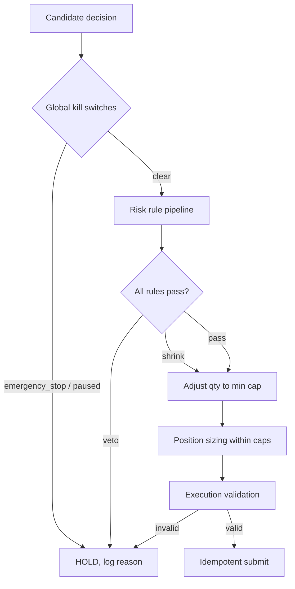

# 06 — Safety & Risk Engine

Safety is deterministic and lives entirely in code. The LLM cannot touch any of it. The
guiding principle is **fail closed**: when in doubt, do nothing.

## 1. Layers of defense



## 2. Risk-rule pipeline

Rules run in order; each returns `RuleOutcome(passed, max_qty, reason)`. A rule may **veto**
(`passed=False`) or **cap** (`max_qty`). The engine takes the **minimum** of all caps and
blocks if any rule vetoes. Every outcome is persisted to `risk_evaluation`.

| # | Rule | Blocks/limits when |
|---|------|--------------------|
| 1 | `EmergencyStopRule` | `system_control.emergency_stop` is set → veto all |
| 2 | `PausedRule` | System paused via dashboard → veto all new entries |
| 3 | `TradingHoursRule` | Outside configured trading window / market closed → veto |
| 4 | `DataFreshnessRule` | Quotes/indicators stale beyond threshold → veto |
| 5 | `PortfolioReconciledRule` | Broker sync failed / unreconciled → veto |
| 6 | `MaxDailyLossRule` | Realized+unrealized daily loss ≥ cap → veto new entries, allow exits |
| 7 | `MaxDrawdownRule` | Equity drawdown from peak ≥ cap → veto new entries |
| 8 | `MaxPortfolioExposureRule` | Gross exposure would exceed cap → cap qty |
| 9 | `MaxPositionSizeRule` | Position value would exceed per-name cap → cap qty |
| 10 | `MaxSectorAllocationRule` | Sector allocation would exceed cap → cap qty |
| 11 | `EarningsBlackoutRule` | Earnings within N days → veto new entries |
| 12 | `CooldownRule` | Last trade in this symbol too recent → veto |
| 13 | `BuyingPowerRule` | Insufficient buying power → cap/veto |
| 14 | `DuplicateOrderRule` | Open order or matching `client_order_id` exists → veto |
| 15 | `MinLiquidityRule` | Avg volume below threshold → veto |

Exits (SELL to reduce/close, and stop-loss triggers) are **allowed even when new entries are
frozen** — risk-off must never trap the system in a losing position.

## 3. Position sizing

Volatility-aware, then clamped:
```
risk_per_trade   = equity * cfg.risk_fraction         # e.g. 0.5%
stop_distance    = atr_14 * cfg.atr_stop_mult          # e.g. 2×ATR
raw_qty          = risk_per_trade / stop_distance
qty = min(raw_qty,
          max_position_value / price,
          remaining_exposure_budget / price,
          remaining_sector_budget / price,
          buying_power / price)
```
Stop-loss and take-profit prices are computed at entry and stored on the `position` row; a
dedicated **stop-monitor** job checks them every cycle independently of the LLM.

## 4. Specific safeguards (mapped to your requirements)

| Requirement | Mechanism |
|-------------|-----------|
| Maximum daily loss | `MaxDailyLossRule` + daily reset job; can auto-trip emergency stop |
| Maximum portfolio exposure | `MaxPortfolioExposureRule` on gross/net exposure |
| Maximum position size | `MaxPositionSizeRule` per-name value cap |
| Trading cooldowns | `CooldownRule` per symbol; global post-loss cooldown |
| API failure handling | Retry+backoff, circuit breakers, `fail-closed` risk inputs |
| News failure handling | Skip failed sources; total failure → neutral LLM signal |
| Internet outage handling | Health monitor detects; risk freezes new entries; stop-monitor still runs on last data with staleness guard |
| Duplicate order prevention | `client_order_id` UNIQUE (DB + Alpaca) + `DuplicateOrderRule` |
| Emergency stop | `system_control.emergency_stop`; halts all entries, optionally flattens |
| Manual override | Dashboard control API → `system_control` / `manual_overrides`, all audit-logged |
| Dry-run mode | `DryRunBroker` logs intended orders, sends nothing |
| Paper trading mode | Default `mode=paper` → Alpaca paper endpoint |

## 5. Emergency stop & manual override

- **Emergency stop** can be tripped three ways: dashboard button, `MaxDailyLossRule`
  breach, or `HealthMonitor` critical event (e.g. repeated broker auth failure). When set:
  new entries are vetoed; optionally auto-flatten open positions if `flatten_on_estop=true`.
- **Manual override** entries are still routed through `ExecutionEngine` and the
  idempotency/duplicate checks — a human can *force intent*, but not bypass order safety or
  create duplicate/invalid orders.
- **Clearing** an emergency stop is itself an audited action requiring explicit confirmation.

## 6. Live-trading gate

Going live requires *all* of: `mode=live` in config, a live API key present, a
`i_understand_live_trading=true` flag, and no active emergency stop. The dashboard shows a
persistent **LIVE** banner. Default and every fresh install is `paper`.

## 7. Fail-closed matrix

| Input unavailable | Behavior |
|-------------------|----------|
| Quotes/indicators stale | Freeze new entries (rule 4); keep monitoring stops |
| LLM down / malformed | `llm_signal = 0`; technical-only, more conservative thresholds |
| News down | LLM skipped; neutral signal |
| Broker down | No orders submitted; park pending; reconcile on recovery |
| Portfolio unreconciled | Freeze entries until reconciled |
| Config invalid at boot | Refuse to start (loud failure) |
