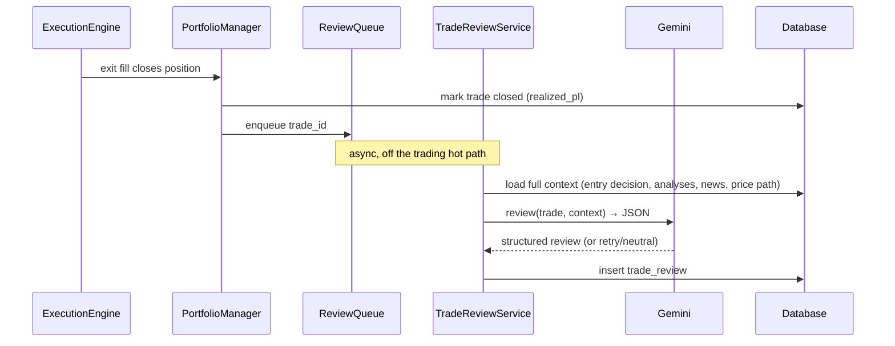

# 07 — Trade Review System (Evolving Journal)

Every time a position closes, CLAV asks Gemini to write a **structured post-mortem**. Over
time this becomes a searchable trading journal that surfaces recurring mistakes and
misleading signals. Reviews are advisory documentation — they never place trades, but their
aggregated insights can inform config/weight tuning by the human operator.

## 1. Trigger & flow



The review worker is a **separate scheduled job**. A failed review is retried with backoff
and never blocks or delays trading.

## 2. Context assembled for the review

For the closed trade, the service gathers the full provenance chain:
- The entry `decision` (scores, weights, reasoning) and `risk_evaluation` (what was
  capped/allowed).
- The `analysis_result`(s) and the exact `news_item`s that fed the entry.
- The price path from entry to exit (candles), realized P&L and return.
- The exit reason (signal, stop-loss, take-profit, manual, risk-forced).

## 3. Questions the review answers

Mapped directly to your spec, emitted as strict JSON:

```json
{
  "trade_id": 123,
  "why_entered": "…concise thesis at entry…",
  "supporting_info": ["…the catalysts/indicators that justified it…"],
  "risks_at_entry": ["…what could go wrong, known at the time…"],
  "reasoning_correct": true,
  "what_worked": ["…signals that proved accurate…"],
  "misleading_signals": ["…signals that pointed the wrong way…"],
  "hindsight_view": "…what the ideal action would have been…",
  "improvements": ["…concrete, testable strategy/config suggestions…"],
  "confidence_calibration": "overconfident|calibrated|underconfident",
  "tags": ["earnings", "false-breakout", "news-fade"]
}
```

`reasoning_correct` is deliberately allowed to be `null` when the outcome is ambiguous — a
small win on a bad thesis should not be scored as correct reasoning.

## 4. Turning reviews into learning

- **Tags & aggregation:** the dashboard aggregates `tags`, `misleading_signals`, and
  `confidence_calibration` across trades to reveal patterns (e.g. "news-fade losses cluster
  around low `source_agreement`").
- **Calibration report:** compare LLM `confidence` at entry vs realized outcome to measure
  whether the model's confidence is trustworthy; feeds the `agreement_factor`/decay tuning.
- **Human-in-the-loop tuning:** suggestions are *proposals*. Weight/threshold/rule changes
  are made by the operator (or, later, an automated experiment behind a backtest gate — see
  [14 — Future Expansion](14-future-expansion.md)). The LLM never rewrites its own risk
  limits.
- **Immutable record:** reviews are append-only; re-reviews create new rows so the evolution
  of thinking is preserved.

## 5. Cost control
Reviews are batched during quiet hours, subject to the same monthly token budget as
analysis. If the budget is exhausted, reviews queue and run when the budget resets.
