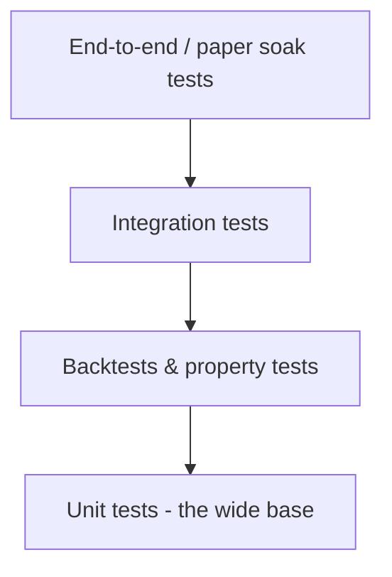

# 11 — Testing Strategy

Because CLAV can spend real money, testing is a first-class concern. The architecture is
built to make the money-losing paths **deterministic and fully mockable**.

## 1. Test pyramid

### Unit tests (the bulk)
- **Risk engine & rules:** the highest-value tests. Each `RiskRule` gets exhaustive
  pass/veto/cap cases. Use `hypothesis` **property tests** to assert invariants that must
  *never* break, e.g.:
  - a rule never *increases* `qty`;
  - the engine output `qty` ≤ every individual rule cap;
  - emergency stop ⇒ no BUY ever approved;
  - exits are permitted whenever entries are frozen.
- **Position sizer:** ATR/exposure/sector clamps; zero/negative/NaN inputs → 0 qty.
- **Decision engine:** pure function; table-driven cases over (technical_score, llm_signal,
  portfolio_bias) → expected action. Deterministic via injected `FakeClock`.
- **Indicators:** compare against known-good reference values.
- **LLM output parsing:** malformed/partial/oversized JSON → repair path → neutral fallback;
  confidence clamped to [0,1].

### Integration tests
- **Adapters against recorded responses:** `vcrpy`/`respx` cassettes for Alpaca, Gemini,
  news. No live network in CI. Tests cover success, 429, 5xx, timeout, and malformed bodies.
- **Idempotency:** submitting the same `client_order_id` twice yields exactly one order.
- **Reconciliation:** simulate a restart with an open broker order/position and assert CLAV
  re-syncs before trading.
- **Repositories/migrations:** run Alembic up/down on a temp SQLite file; assert constraints
  (unique `content_hash`, unique `client_order_id`, FK integrity).

### Backtests
- A `HistoricalDataSource` + `PaperBroker` replay drives the **real** DecisionEngine and
  RiskEngine over historical candles/news. Because those components are pure and clock-
  injected, the backtest exercises production logic, not a parallel implementation.
- Metrics: return, max drawdown, hit rate, and **rule-trigger counts** (did safety fire when
  it should?). Guards against silent strategy regressions.

### End-to-end / soak
- **Paper soak test:** run the whole system in `paper` mode for days against live-but-fake
  Alpaca; assert no unhandled exceptions, no duplicate orders, health stays green, and every
  trade has a full provenance chain and (eventually) a review.

## 2. Chaos / failure injection
Deliberately fault external services in a staging config:
- Broker returns 500s / times out → orders park & retry, nothing double-fills.
- Gemini times out / returns garbage → `llm_signal=0`, trading continues technical-only.
- News source down → skipped, cycle proceeds.
- Kill `clav-core` mid-order → systemd restarts → reconcile → no duplicate.
- Clock jumps / market-closed → `TradingHoursRule` vetoes.

## 3. Safety-critical invariants (must be enforced by tests in CI)
1. No order is ever submitted without a passing `RiskDecision`.
2. `emergency_stop` or `paused` ⇒ zero new entries.
3. No two orders share a `client_order_id`.
4. Live mode requires the explicit config gate; default config trades paper.
5. The LLM path has **no reference** to the broker or credentials (enforced by
   `import-linter`: `domain`/`integrations/gemini*` cannot import `broker`).

## 4. Tooling & CI
- `pytest` + `pytest-cov` (coverage gate on `domain/risk` especially high, e.g. 95%+).
- `ruff` (lint+format), `mypy --strict` on `domain/` and `interfaces/`.
- `import-linter` layered-architecture contract in CI (fails the build on a boundary
  violation).
- CI runs offline (cassettes only). A separate, manually-triggered job may run a short
  paper-mode smoke test with real sandbox keys.
