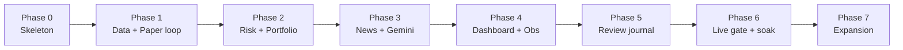

# 12 — Development Roadmap

Phased so that **something safe and testable exists early**, and every phase ships a working
system. Money-touching capability arrives only after the safety and observability layers are
proven in paper mode.

## Phase 0 — Skeleton & guardrails
- Repo, `pyproject`, layered folders, config (Pydantic Settings), logging, SQLite + Alembic
  baseline, `Clock` abstraction.
- Interfaces defined (`Broker`, `MarketDataSource`, `NewsSource`, `Analyst`).
- `DryRunBroker` + `PaperBroker`; composition root; systemd units.
- CI: pytest, ruff, mypy, import-linter contract.
- **Exit criteria:** a scheduled no-op cycle runs, logs, and persists a `scan_cycle` row.

## Phase 1 — Market data + paper trading loop
- `AlpacaDataAdapter` (quotes/candles/clock), `IndicatorService`, `DecisionEngine`
  (technical-only).
- End-to-end BUY/SELL/HOLD in **paper** mode with idempotent orders + fill reconciliation.
- **Exit criteria:** system autonomously paper-trades a watchlist on technicals; full
  provenance persisted; backtest harness runs the real engine.

## Phase 2 — Risk engine & portfolio manager
- All `RiskRule`s, `PositionSizer`, `PortfolioManager` (exposure/drawdown/sector), startup
  reconciliation, emergency stop + pause via `system_control`.
- Property tests for risk invariants.
- **Exit criteria:** no trade reaches the broker without a passing `RiskDecision`; safety
  invariants green in CI.
- Delivered by **[Epic 2 — Full Risk Engine, Volatility Sizing & Portfolio Accounting](epics/epic-02-risk-and-portfolio.md)**.

## Phase 3 — News + social + Gemini analysis (advisory signal) + operator control
- **Free-tier** news/filings adapters (RSS + SEC EDGAR; NewsAPI optional/off) and retail
  **social-sentiment** adapters (Reddit + StockTwits; X/Twitter excluded — no free read tier)
  + dedup/cache; `GeminiAnalyst` with strict JSON + validation + neutral fallback; `llm_signal`
  wired into scoring with configurable weights; token/cost budget + circuit breaker.
- **Two-stage bot/spam defense:** deterministic Stage-1 filtering + aggregation (engagement/
  reputation floors, dedup, volume baselines, anomaly flags) shrinks the social firehose to a
  compact digest; Gemini applies Stage-2 judgement on that digest, never the raw feed — keeping
  token cost inside the free budget and shrinking the prompt-injection surface.
- Gemini becomes the **proposer** — it chooses *what* and *why* — while the Phase-2 risk engine
  stays the hard gate; passing trades **execute autonomously** (no per-trade approval), and every
  decision is written to a reviewable **decision journal**. A minimal authenticated web surface
  lets the operator *supervise and tune*: browse the journal, edit the strategy prompt, adjust
  weights/risk, and manage the watchlist, with an always-available e-stop. Per-trade approval is
  an optional off-by-default mode. (The rich observability dashboard remains Phase 4.)
- **Exit criteria:** LLM enriches/drives decisions but its failure never blocks, distorts, or
  hijacks trading (chaos + prompt-injection tests prove technical-only degradation), and no trade
  reaches the broker without passing the risk gate (and, when the optional approval mode is
  enabled, operator approval).
- Delivered by **[Epic 3 — Gemini Analyst, News & Human-Steerable Trading](epics/epic-03-gemini-and-control.md)**.

## Phase 4 — Dashboard & observability
- FastAPI + HTMX dashboard (portfolio, positions, trades, AI explanations, confidence,
  health, logs); guarded controls; `/health` + `/metrics`; alerting.
- **Exit criteria:** operator can observe and safely control the running system remotely
  (over Tailscale/SSH).
- Detailed in **[Epic 4 — Observability Dashboard, Metrics & Alerting](epics/epic-04-dashboard-and-observability.md)**
  (scoped; builds on Epic 3's `clav-web` API + persisted records).

## Phase 5 — Trade review journal
- `TradeReviewService` + review worker; aggregation/tags/calibration views in the dashboard.
- **Exit criteria:** every closed paper trade gets a structured review; journal is
  searchable.

## Phase 6 — Live-trading gate & soak
- Live config gate, LIVE banner, flatten-on-estop; multi-day **paper soak** then a small,
  capital-capped live pilot.
- **Exit criteria:** clean soak (no dup orders, no unhandled errors, green health); reviewed
  go-live checklist signed off.

## Phase 7 — Expansion
- Pick from [14 — Future Expansion](14-future-expansion.md): multi-agent, multi-broker,
  crypto, ML models, local LLM, distributed. Each is additive behind existing interfaces.

## Suggested sequencing principle
Ship **safety and observability before capability**. It is always correct to have a system
that trades conservatively and explains itself, and never correct to have one that trades
aggressively and cannot.
