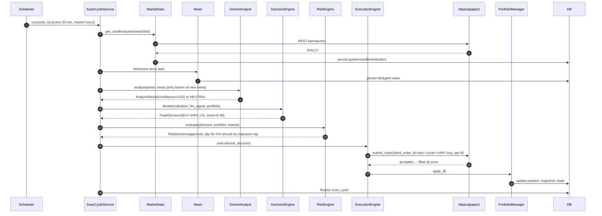
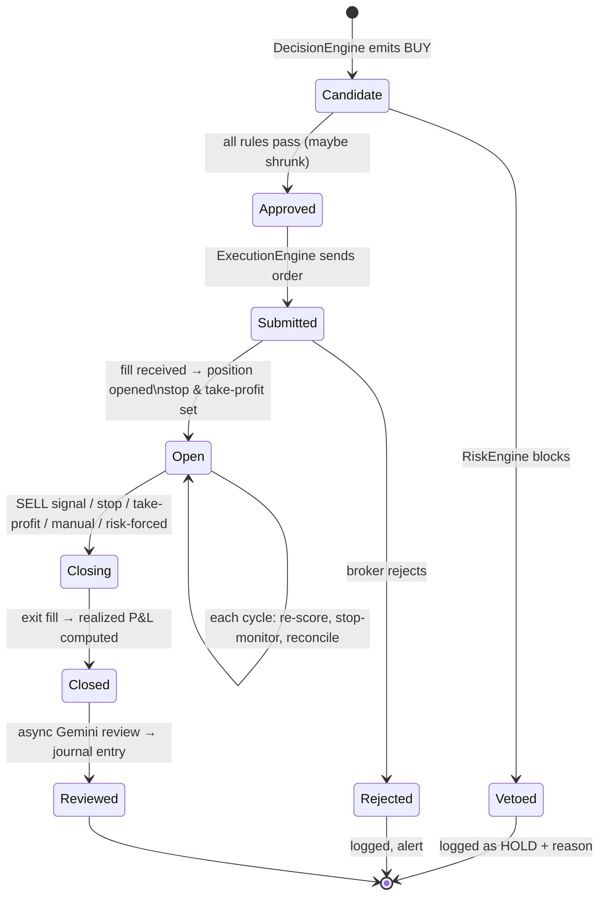
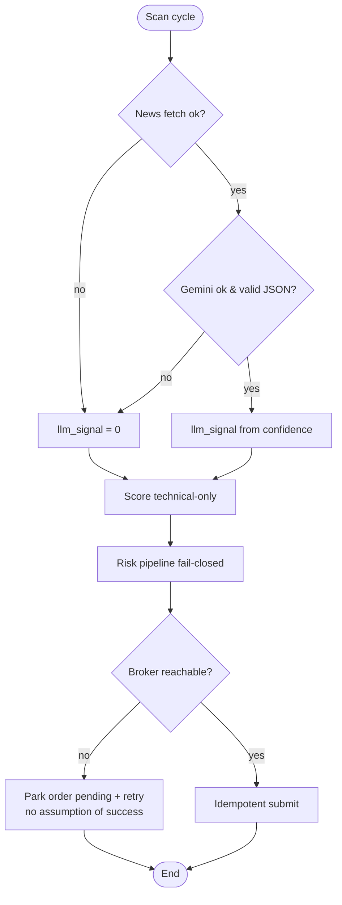

# 13 — Flows & Trade Lifecycle

## 1. Example request/response flow (one scan cycle)

Note the shrink at step 12: the LLM was bullish, but the **exposure cap deterministically
reduced size from 10 to 8** — the risk engine, not the LLM, had the final word.

## 2. Full trade lifecycle (entry → hold → exit → review)

### Narrative walk-through
1. **Entry decision.** Technicals give +0.3; Gemini reports bullish, confidence 0.62, mixed
   sources → `llm_signal ≈ +0.43`; weighted `raw_score = 0.48` > buy threshold → candidate
   BUY.
2. **Risk gate.** Hours ✓, data fresh ✓, daily-loss ✓, no earnings blackout ✓, but portfolio
   exposure cap trims qty 10→8. `RiskDecision(approved, qty=8)` persisted with the cap
   reason.
3. **Execution.** Deterministic `client_order_id` submitted to Alpaca paper; fill received;
   `position` opened with stop (2×ATR) and take-profit stored.
4. **Hold.** Each cycle re-scores the name, the independent **stop-monitor** checks the stop,
   and the portfolio reconciles against the broker.
5. **Exit.** A stop-loss trips (or a SELL signal, take-profit, manual, or risk-forced
   exit). Exit order submitted; `trade` closed with realized P&L and exit reason.
6. **Review.** The closed trade is queued; Gemini writes a structured post-mortem
   (why entered, what worked, misleading signals, improvements) stored as a `trade_review`.
7. **Learning.** The dashboard aggregates review tags and confidence calibration; the
   operator uses these to tune weights/rules (never the LLM itself).

## 3. Degraded-mode flow (LLM/news/broker failure)

The invariant across all failure modes: **the system trades more conservatively or not at
all — it never trades more aggressively because information is missing.**
