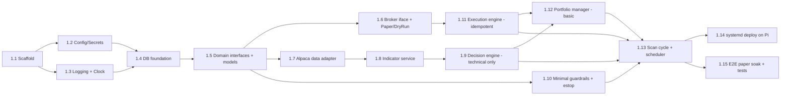

# Epic 1 — Foundation & First Autonomous Paper Trade

> **Goal:** Stand up a running, always-on skeleton on the Pi that autonomously scans a
> watchlist, makes **technical-only** Buy/Sell/Hold decisions, executes them against the
> **Alpaca paper** account idempotently, tracks the resulting portfolio, and persists a full
> provenance trail — with minimal guardrails and an emergency stop.
>
> This is Phase 0 + Phase 1 of the [roadmap](../12-roadmap.md). **No news, no Gemini, no
> full risk engine, no dashboard yet** — those are Epics 2–4. The point of Epic 1 is a
> correct, observable, safe-by-default trading *loop* we can build everything else onto.

## Epic-level definition of done

- `clav-core` runs under systemd on the Pi, survives restarts, and executes a scheduled scan
  cycle during market hours.
- On a watchlist of N tickers, the system fetches candles → computes indicators → decides →
  (minimal guardrails) → submits paper orders → records fills → updates the portfolio.
- Every decision and order is persisted with a `cycle_id` correlation id; a closed loop can
  be reconstructed from the DB.
- **Paper is the only mode reachable in Epic 1** (live is not wired). Emergency stop and
  pause halt new entries.
- Restarting mid-cycle never produces a duplicate order (idempotency + reconciliation).
- CI runs green: unit tests, lint, types, and the layered-import contract.

## Epic-level acceptance demo
Point the system at a 5–10 ticker watchlist in paper mode, let it run a full trading day
(or replay), then show: the `scan_cycle`/`decision`/`order`/`fill`/`trade` rows, the logs
correlated by `cycle_id`, a restart that reconciles cleanly, and the emergency stop freezing
new entries.

## Out of scope (deferred)
- News collection & Gemini analysis → **Epic 3** (`llm_signal` is hardcoded to `0` here).
- Full 15-rule risk engine, volatility sizing, sector caps → **Epic 2**.
- Web dashboard, metrics endpoints, alerting → **Epic 4**.
- Trade-review journal → **Epic 5**.
- Live trading → **Epic 6**.

---

## Story map & sequencing



Rough size: **~34 points**. Critical path: 1.1 → 1.2/1.3 → 1.4 → 1.5 → 1.7 → 1.8 → 1.9 →
1.11 → 1.13 → 1.15.

---

## Story 1.1 — Project scaffold & tooling  ·  2 pts
**As a** developer **I want** a layered repo with quality gates **so that** architecture
boundaries are enforced from commit one.

**Acceptance criteria**
- `pyproject.toml` with pinned deps; `src/clav/` layout matching [08 — Project Structure](../08-project-structure.md).
- Empty package layers created: `domain/`, `interfaces/`, `integrations/`, `services/`,
  `data/`, `common/` (with `__init__.py`).
- `ruff`, `mypy` (strict on `domain/`+`interfaces/`), `pytest`, `import-linter` configured.
- **`import-linter` contract fails the build** if `domain/`/`interfaces/` import from
  `integrations/`.
- CI workflow runs lint + types + tests + contract on push.

**Tasks:** init repo & venv (`uv`); write `pyproject`; add tool configs; write the layered
contract; add a trivial passing test; wire CI.

---

## Story 1.2 — Configuration & secrets  ·  2 pts
**As an** operator **I want** typed, validated config with secrets in `.env` **so that**
misconfiguration fails loudly at startup and keys never land in git.

**Acceptance criteria**
- `config.py` uses `pydantic-settings`; loads `config.yaml` + `.env`.
- Config models for: `mode` (default **`paper`**; `live` rejected/guarded in Epic 1),
  watchlist, Alpaca paper creds, scan interval, trading window, weights/thresholds, minimal
  risk caps.
- Invalid/missing required config ⇒ process refuses to start with a clear message.
- `config.example.yaml` + `.env.example` committed; real files gitignored.
- `config_snapshot` capability stub (effective config serializable for later persistence).

**Tasks:** define Settings models + validators; example files; unit tests for
valid/invalid/missing.

---

## Story 1.3 — Logging & Clock abstraction  ·  2 pts
**As a** developer **I want** structured logging and an injectable clock **so that** cycles
are traceable and logic is deterministically testable.

**Acceptance criteria**
- `structlog` JSON logging to rotating file + stdout/journald; secret-redaction processor.
- Every log line can carry a `cycle_id`/correlation id via bound context.
- `Clock` interface with `SystemClock` and `FakeClock`; **no module reads wall-clock time
  directly** (mypy/lint check or review rule).
- Unit test proves `FakeClock` controls "now".

**Tasks:** logging setup + redaction; `clock.py`; wire correlation-id binding helper.

---

## Story 1.4 — Database foundation  ·  3 pts
**As a** developer **I want** SQLite (WAL) + SQLAlchemy + Alembic with the Epic-1 tables
**so that** all state is persisted and migratable.

**Acceptance criteria**
- `data/db.py` sets WAL PRAGMAs (journal_mode, synchronous=NORMAL, foreign_keys=ON,
  busy_timeout) per [03 — Database](../03-database.md).
- SQLAlchemy models + Alembic baseline for the Epic-1 subset: `instrument`, `candle`,
  `indicator_set`, `scan_cycle`, `decision`, `order`, `fill`, `trade`, `position`,
  `portfolio_snapshot`, `system_control`, `audit_log`.
- **UNIQUE constraints** on `order.client_order_id` and `candle(instrument_id,timeframe,ts)`.
- Repository classes are the only code issuing SQL.
- `alembic upgrade head` / `downgrade` runs clean on a temp DB in tests.

**Tasks:** engine/session + PRAGMAs; models; Alembic init + baseline; repositories;
migration up/down test.

---

## Story 1.5 — Domain interfaces & models  ·  2 pts
**As a** developer **I want** the abstract interfaces and Pydantic domain types **so that**
adapters and logic are decoupled and mockable.

**Acceptance criteria**
- Interfaces: `MarketDataSource`, `Broker` (Analyst/NewsSource stubbed for later epics).
- Domain models: `Quote`, `Candle`, `IndicatorSet`, `TradeDecision`, `RiskDecision`,
  `Order`, `Fill`, `PortfolioSnapshot` (Pydantic).
- No vendor imports in `domain/`/`interfaces/` (contract green).

**Tasks:** write ABCs/Protocols; write models; type-check strict.

---

## Story 1.6 — Broker interface: Paper & DryRun  ·  3 pts
**As a** system **I want** a `Broker` abstraction with paper and dry-run implementations
**so that** trading is safe-by-default and testable without real orders.

**Acceptance criteria**
- `PaperBroker` wraps the **Alpaca paper** trading endpoint (`alpaca-py`): submit/cancel,
  get positions, get account, get clock.
- `DryRunBroker` logs intended orders and sends nothing (used in tests/shadow).
- `broker_factory(mode)` returns paper/dryrun; **live raises `NotImplementedError` in Epic 1**.
- Adapter passes `client_order_id` through to Alpaca.
- Integration tests use recorded responses (`respx`/`vcrpy`) — no live network in CI.

**Tasks:** interface impls; factory; cassettes for accept/reject/429/timeout.

---

## Story 1.7 — Alpaca market-data adapter  ·  3 pts
**As a** system **I want** normalized quotes/candles/clock from Alpaca **so that** the
pipeline has price data.

**Acceptance criteria**
- `AlpacaDataAdapter` implements `MarketDataSource`: latest quote, historical bars (daily +
  configurable intraface), market clock/calendar.
- Returns normalized domain `Quote`/`Candle`; persists via repositories with freshness
  timestamps; marks `is_stale` on failure fallback.
- Wrapped in retry-with-backoff (`tenacity`) distinguishing transient vs permanent errors.
- Fetches only the last K bars (RAM discipline for the Pi).
- Integration tests over cassettes incl. error/timeout/malformed.

**Tasks:** adapter; normalization; retry wrapper; staleness handling; tests.

---

## Story 1.8 — Indicator service  ·  2 pts
**As a** decision engine **I want** technical indicators computed locally **so that** scoring
works without a vendor indicator API.

**Acceptance criteria**
- `IndicatorService.compute(candles) -> IndicatorSet` for SMA/EMA, RSI, MACD, ATR, Bollinger,
  volume MA (numpy hand-rolled per RAM decision; pending your library confirmation).
- `technical_score(iset) -> float` in `[-1, 1]`, deterministic.
- Values match known-good reference fixtures (unit tests); handles insufficient-history
  gracefully (returns partial/None, never crashes the cycle).

**Tasks:** implement indicators; scoring function; reference-value tests; edge cases.

---

## Story 1.9 — Decision engine (technical-only)  ·  2 pts
**As a** system **I want** a pure Buy/Sell/Hold decision from indicators + portfolio **so
that** the loop can act.

**Acceptance criteria**
- `DecisionEngine.decide(iset, llm_signal=0, portfolio) -> TradeDecision`.
- Uses the weighted formula from [00 — Overview](../00-overview.md) with `w_llm` term = 0 in
  Epic 1 (interface already accepts `llm_signal` for Epic 3).
- Pure function (injected `Clock`), fully table-test driven; identical inputs ⇒ identical
  output.
- Emits `reasoning` dict (score components) for persistence.

**Tasks:** scoring/thresholds; action selection; reasoning payload; table tests.

---

## Story 1.10 — Minimal guardrails & emergency stop  ·  3 pts
**As an** operator **I want** basic safety gates and a kill switch **so that** the paper loop
can't misbehave and the full risk engine has a home.

**Acceptance criteria**
- A minimal `RiskEngine` running an ordered, fail-closed subset of rules: `EmergencyStopRule`,
  `PausedRule`, `TradingHoursRule`, `MaxPositionSizeRule`, `BuyingPowerRule`,
  `DuplicateOrderRule`. (Full 15-rule pipeline = Epic 2.)
- Each rule can **veto or cap** only; engine takes the min cap and records a
  `risk_evaluation`-style outcome (table may be added now or in Epic 2 — decision noted).
- `system_control` K/V table drives `emergency_stop`/`paused`; a CLI/command can set them.
- **Exits are allowed while entries are frozen.**
- Property test: emergency stop ⇒ no BUY ever approved; no rule increases qty.

**Tasks:** rule interface + 6 rules; engine min-cap logic; `system_control` toggles + CLI;
invariant tests.

---

## Story 1.11 — Execution engine (idempotent + reconciliation)  ·  3 pts
**As a** system **I want** validated, idempotent order submission with fill reconciliation
**so that** orders are never duplicated and state matches the broker.

**Acceptance criteria**
- `ExecutionEngine.execute(risk_decision)` validates (qty>0, market open, buying power, no
  duplicate open order) then submits via `Broker`.
- Deterministic `client_order_id = clav-<cycle_id>-<symbol>-<side>`; resubmission is a no-op.
- Retry-with-backoff on transient broker errors; permanent errors logged, order marked
  failed, alert hook fired.
- `reconcile()` on startup: pull open orders/positions from broker and sync DB **before** any
  new decision.
- Persists `order`/`fill`; failed/parked orders retried, never assumed successful.
- Tests: double-submit ⇒ one order; restart-with-open-order ⇒ reconciles, no dup.

**Tasks:** validation; client-order-id; submit+retry; reconciliation; persistence; tests.

---

## Story 1.12 — Portfolio manager (basic)  ·  2 pts
**As a** system **I want** positions, cash, and P&L tracked **so that** decisions and
guardrails have accurate state.

**Acceptance criteria**
- `PortfolioManager.apply_fill()` updates `position`/`trade`; opens/closes trades and computes
  realized/unrealized P&L.
- `snapshot() -> PortfolioSnapshot` with cash, equity, positions, exposure (drawdown/sector
  can be stubbed for Epic 2).
- `reconcile(broker)` marks snapshot `unreconciled` on sync failure (consumed by guardrails
  later).
- Unit tests for open→add→partial-close→close P&L math.

**Tasks:** fill application; trade lifecycle; snapshot; P&L math tests.

---

## Story 1.13 — Scan-cycle orchestration & scheduler  ·  3 pts
**As a** system **I want** a scheduled scan cycle wiring all modules **so that** trading runs
autonomously.

**Acceptance criteria**
- `ScanCycleService.run(cycle_id)`: gate (market open + estop clear) → data → indicators →
  decision (`llm_signal=0`) → guardrails → execution → portfolio update → persist
  `scan_cycle`.
- Composition root (`app.py`) assembles everything from config (DI); `broker_factory`
  selects paper/dryrun.
- `APScheduler` jobs: scan cycle (configurable interval, market hours), startup
  reconciliation, daily reset (peak equity / counters).
- Cycle is resilient: one ticker's failure doesn't abort the whole cycle; everything logged
  with `cycle_id`.
- Integration test drives a full cycle with `DryRunBroker` + fixture data.

**Tasks:** orchestrator; composition root; scheduler jobs; per-ticker isolation; cycle test.

---

## Story 1.14 — Raspberry Pi deployment  ·  2 pts
**As an** operator **I want** `clav-core` running under systemd on the Pi **so that** it's
always-on and self-healing.

**Acceptance criteria**
- `clav-core.service` unit with `Restart=on-failure`, `MemoryMax`, `EnvironmentFile`, runs as
  the `clav` user (per [09 — Deployment](../09-deployment.md)).
- `install.sh` (venv sync, `alembic upgrade head`, enable+start service) and `backup.sh`
  (nightly `VACUUM INTO`).
- DB + logs live on the SSD path, not the SD card.
- Verified: reboot ⇒ service auto-starts and reconciles; crash ⇒ restarts.

**Tasks:** systemd unit; install/backup scripts; SSD paths; reboot/crash verification.

---

## Story 1.15 — End-to-end paper soak & test suite  ·  2 pts
**As a** stakeholder **I want** an E2E paper run plus a safety-invariant test suite **so
that** Epic 1 is demonstrably correct.

**Acceptance criteria**
- E2E test (or a short live paper soak) drives real modules end to end in paper/dryrun and
  asserts: full provenance chain persisted, no duplicate orders, no unhandled exceptions,
  emergency stop freezes new entries.
- CI enforces the Epic-1 safety invariants: (1) no order without a passing guardrail decision;
  (2) estop/pause ⇒ no new entries; (3) unique `client_order_id`; (4) live mode unreachable.
- Coverage gate high on `domain/` and the guardrail rules.
- Short runbook in README: how to start/stop, trip/clear estop, read the logs.

**Tasks:** E2E harness; invariant tests in CI; coverage gate; runbook.

---

## Dependencies & risks
- **External:** Alpaca paper account + API keys must exist before 1.6/1.7. Confirm free-tier
  IEX data is sufficient for the watchlist timeframe.
- **Open decisions feeding Epic 1:** indicator library (numpy vs pandas-ta), watchlist size,
  scan interval. Defaults are in the docs; confirm before 1.8/1.13.
- **Risk:** `pandas`/build weight on ARM — mitigated by numpy indicators (1.8).
- **Sequencing:** 1.10 (guardrails) intentionally ships *before* 1.13 wires execution into the
  cycle, so no autonomous order can ever bypass a gate — even in the first paper run.
```
