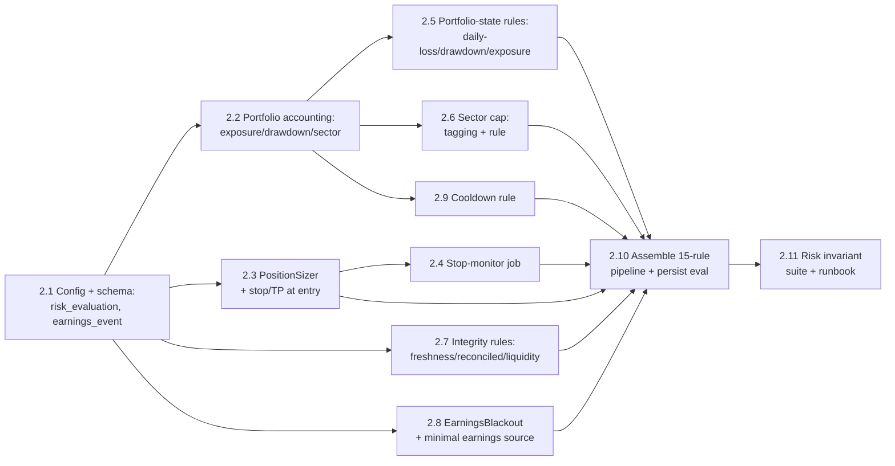

# Epic 2 — Full Risk Engine, Volatility Sizing & Portfolio Accounting

> **Goal:** Close the gap between the *minimal* Epic-1 safety subset and the deterministic
> risk system the architecture actually specifies. Ship the **full 15-rule risk pipeline**,
> **volatility-aware (ATR) position sizing** with stop-loss/take-profit, a **portfolio
> manager that computes real exposure/drawdown/sector allocation**, and persist **every risk
> evaluation** for audit — all still in **paper mode**, LLM signal still `0`.
>
> This is Phase 2 of the [roadmap](../12-roadmap.md). It implements [06 — Safety & Risk](../06-safety-and-risk.md)
> in full. **No news, no Gemini, no dashboard, no live trading** — those remain Epics 3/4/6.
> The point of Epic 2 is that **no trade can reach the broker without passing a complete,
> persisted `RiskDecision`, sized to volatility and clamped by portfolio-level caps.**

## Where Epic 1 left off

Epic 1 (Story 1.10) shipped a deliberately minimal, fail-closed `RiskEngine` with **6 of the
15 rules** and left the rest as documented stubs. Epic 2 fills those gaps. Concretely, today:

- **Shipped rules** (`src/clav/domain/risk/rules.py`): `EmergencyStopRule`, `PausedRule`,
  `TradingHoursRule`, `MaxPositionSizeRule`, `BuyingPowerRule`, `DuplicateOrderRule`.
- **Missing rules** (9): `DataFreshnessRule`, `PortfolioReconciledRule`, `MaxDailyLossRule`,
  `MaxDrawdownRule`, `MaxPortfolioExposureRule`, `MaxSectorAllocationRule`,
  `EarningsBlackoutRule`, `CooldownRule`, `MinLiquidityRule`.
- **Position sizing** is a flat `default_order_value / price` (config `risk.default_order_value`);
  there is **no `PositionSizer`, no ATR sizing, and no stop-loss/take-profit** computed at
  entry. `position.stop_price` / `take_profit_price` columns exist but are never populated.
- **`PortfolioManager.snapshot()`** computes `gross_exposure` on **cost basis** (qty × avg
  entry), and returns `drawdown=0`, `peak_equity=0`, empty `sector_allocation`,
  `unrealized_pl=0` — all documented Epic-2 simplifications (`src/clav/domain/portfolio.py`).
- **Risk outcomes are not persisted.** `RiskEngine.evaluate()` returns a `RiskDecision` that is
  only logged (`risk_evaluated`) and threaded to execution; the `risk_evaluation` table from
  [03 — Database](../03-database.md) §Decision-&-execution **does not exist yet**.
- **`daily_reset()`** in `ScanCycleService` is a no-op; there is no peak-equity or daily-loss
  counter to reset.
- **`instrument.sector`** column exists but nothing populates it; **`earnings_event`** table
  is not defined.

## Epic-level definition of done

- The `RiskEngine` runs **all 15 rules in the canonical order** of [06 §2](../06-safety-and-risk.md#2-risk-rule-pipeline),
  each returning `RuleOutcome(passed, max_qty, reason)`; the engine takes the **min cap** and
  blocks on **any veto** (unchanged min-cap semantics).
- Position size is **volatility-aware**: `raw_qty = (equity × risk_fraction) / (atr_14 ×
  atr_stop_mult)`, then clamped by per-name, exposure, sector, and buying-power budgets per
  [06 §3](../06-safety-and-risk.md#3-position-sizing). Stop-loss and take-profit are computed
  at entry and stored on the `position` row.
- A **stop-monitor** job checks stop/take-profit every cycle, independent of the decision
  engine, and can emit exits **even when new entries are frozen**.
- `PortfolioManager` computes **live** market value, unrealized P&L, gross/net exposure,
  drawdown vs. tracked peak equity, and per-sector allocation.
- **Every** decision that reaches the risk engine persists a `risk_evaluation` row
  (approved/shrunk/vetoed + which rules, + reasons). A closed trade can be walked back to the
  exact rule outcomes that allowed it.
- `MaxDailyLossRule` can **auto-trip the emergency stop**; `daily_reset` resets peak-equity and
  daily counters.
- The **entries-vs-exits invariant holds for every new freeze rule**: SELL/exit decisions and
  stop-monitor exits are never vetoed by a freeze-style rule.
- CI enforces the risk invariants as **property tests** (below); coverage gate stays high on
  `domain/risk/` and `domain/portfolio.py`.

## Epic-level acceptance demo

Run a paper cycle on a watchlist where portfolio state deliberately trips caps: show a BUY
**shrunk** by `MaxSectorAllocationRule`, a BUY **vetoed** by `CooldownRule`, a BUY **vetoed**
by `EarningsBlackoutRule`, position sizing that halves when ATR doubles, a stop-loss exit
fired by the stop-monitor while `emergency_stop` is set, `MaxDailyLossRule` auto-tripping the
e-stop, and the `risk_evaluation` rows joining `decision → order` for each. Then show the
safety-invariant test suite green in CI.

## Out of scope (deferred)

- News collection & Gemini analysis → **Epic 3** (`llm_signal` stays `0`; `w_llm=0`).
- Full earnings/economic **calendar integration** → seeded minimally here (see Story 2.8);
  the live EDGAR/news-driven feed lands with **Epic 3**.
- Web dashboard controls, `/health`, `/metrics`, alerting → **Epic 4** (Epic 2 keeps the CLI
  toggles + `alert_hook` from Epic 1).
- Trade-review journal → **Epic 5**. Live trading → **Epic 6**.

---

## Story map & sequencing

Rough size: **~30 points**. Critical path: 2.1 → 2.2 → 2.3 → 2.5/2.6 → 2.10 → 2.11.
Stories 2.4, 2.7, 2.8, 2.9 are largely independent and parallelizable after 2.1/2.2.

---

## Story 2.1 — Risk config & audit-schema foundations · 3 pts
**As a** developer **I want** the expanded risk config and the `risk_evaluation` /
`earnings_event` tables **so that** every later rule has its thresholds and every evaluation
has somewhere to be persisted.

**Acceptance criteria**
- `RiskConfig` (in `config.py`) gains validated fields (all bounded, with sane defaults):
  `risk_fraction`, `atr_stop_mult`, `take_profit_mult`, `max_daily_loss_pct`,
  `max_drawdown_pct`, `max_portfolio_exposure_pct`, `max_sector_allocation_pct`,
  `earnings_blackout_days`, `cooldown_minutes`, `post_loss_cooldown_minutes`,
  `min_avg_volume`, `quote_staleness_seconds`, `flatten_on_estop` (default `false`).
  Existing `max_position_value` / `default_order_value` / `buying_power_buffer_pct` are kept
  (the flat value now acts as the **fallback** when ATR is unavailable — see 2.3).
- New SQLAlchemy tables + Alembic migration for **`risk_evaluation`** (`id, decision_id,
  approved, adjusted_qty, blocked_by(json), notes(json), evaluated_at`) and **`earnings_event`**
  (`id, instrument_id, event_type, scheduled_at, confirmed, source`), matching
  [03 — Database](../03-database.md).
- Repository classes for both; `risk_evaluation` linked to `decision.id`.
- `config.example.yaml` updated with the new keys + comments; invalid ranges fail at boot
  (loud `ConfigError`), consistent with Epic 1.
- `alembic upgrade head`/`downgrade` clean on a temp DB in tests.

**Tasks:** extend `RiskConfig` + validators + example; add two ORM models + migration;
repositories; up/down migration test.

---

## Story 2.2 — Portfolio accounting: exposure, drawdown, sector · 3 pts
**As a** risk engine **I want** a `PortfolioSnapshot` with real market value, drawdown, and
sector allocation **so that** the portfolio-level caps have accurate numbers to clamp against.

**Acceptance criteria**
- `PortfolioManager.snapshot()` uses **live quotes** (via the injected `MarketDataSource` or
  broker positions' market value) to compute `market_value`, `unrealized_pl`, and
  `gross_exposure`/`net_exposure` on **market value** (replacing the Epic-1 cost-basis
  simplification noted in `portfolio.py`).
- **Peak equity** is tracked across cycles and persisted; `drawdown = (peak − equity)/peak`.
- `sector_allocation` (json) computed from `instrument.sector` and per-position market value.
- `ScanCycleService.daily_reset()` resets the daily-loss counter and re-bases peak equity per
  the daily-reset job (no longer a no-op).
- Snapshot still marks `reconciled=False` on broker sync failure (unchanged fail-closed).
- Unit tests: peak/drawdown across a rise-then-fall equity path; sector allocation math;
  unrealized P&L against fixture quotes.

**Tasks:** wire quotes into snapshot; peak-equity tracking + persistence; sector allocation;
daily-reset counters; math tests.

---

## Story 2.3 — Volatility-aware position sizing + stops · 3 pts
**As a** system **I want** ATR-based sizing with stop-loss/take-profit at entry **so that**
risk-per-trade is constant across names of different volatility.

**Acceptance criteria**
- A pure `PositionSizer.size(equity, price, atr_14, budgets) -> SizingResult` implementing
  [06 §3](../06-safety-and-risk.md#3-position-sizing):
  `risk_per_trade = equity × risk_fraction`, `stop_distance = atr_14 × atr_stop_mult`,
  `raw_qty = risk_per_trade / stop_distance`, then `min(raw_qty, max_position_value/price,
  remaining_exposure_budget/price, remaining_sector_budget/price, buying_power/price)`.
- Computes `stop_price = entry − stop_distance` and `take_profit_price = entry +
  stop_distance × take_profit_mult`; these are **persisted on the `position` row** in
  `PortfolioManager._apply_buy` (columns already exist).
- **Fail-closed fallback:** when `atr_14` is `None` (insufficient history — `IndicatorSet`
  allows it), fall back to the flat `default_order_value/price` sizing and set no stop, logged
  explicitly. Sizing never returns a negative or fractional qty; `≤0` ⇒ HOLD.
- Deterministic and table-test driven: doubling ATR halves `raw_qty`; each budget clamp
  exercised in isolation.

**Tasks:** `PositionSizer`; stop/TP computation + persistence; ATR-missing fallback; wire the
budgets (from snapshot + config); table tests.

---

## Story 2.4 — Stop-monitor job · 2 pts
**As a** system **I want** a job that checks stops/take-profits every cycle independent of the
LLM/decision path **so that** risk-off exits fire even when entries are frozen.

**Acceptance criteria**
- A `StopMonitor` (run at the start of each cycle, before/alongside symbol processing) reads
  open positions with `stop_price`/`take_profit_price`, compares against the latest quote, and
  emits **SELL exit decisions** for breached positions.
- Exits route through the **same `ExecutionEngine`** (idempotent `client_order_id`,
  reconciliation) — no bypass of order safety, consistent with [06 §5](../06-safety-and-risk.md#5-emergency-stop--manual-override).
- Runs and can exit **while `emergency_stop`/`paused` are set and while entries are frozen** by
  any rule (the entries-vs-exits invariant).
- Staleness guard: on stale/missing quotes the monitor does **not** fire (fail-closed — no
  exits on bad data), logged.
- Tests: price crossing stop ⇒ one exit order; e-stop set ⇒ exit still allowed; stale quote ⇒
  no action; already-closed position ⇒ no-op.

**Tasks:** `StopMonitor`; wire into `ScanCycleService.run` before entries; staleness guard;
exit-order path; tests.

---

## Story 2.5 — Portfolio-state rules: daily-loss, drawdown, exposure · 3 pts
**As an** operator **I want** account-level circuit breakers **so that** a bad day freezes new
entries automatically.

**Acceptance criteria**
- `MaxDailyLossRule` (rule 6): realized+unrealized daily loss ≥ `max_daily_loss_pct` ⇒ **veto
  new entries, allow exits**; on breach it **auto-trips `emergency_stop`** via `system_control`
  and fires the `alert_hook`.
- `MaxDrawdownRule` (rule 7): equity drawdown from peak ≥ `max_drawdown_pct` ⇒ veto new entries.
- `MaxPortfolioExposureRule` (rule 8): gross exposure that would exceed
  `max_portfolio_exposure_pct × equity` ⇒ **cap** qty to the remaining exposure budget.
- All three read the Story-2.2 snapshot; all three are **BUY-only freezes** (exits pass
  through), following the existing `rules.py` pattern.
- Property tests: loss ≥ cap ⇒ no BUY approved + e-stop set; drawdown ≥ cap ⇒ no BUY; exposure
  cap only ever shrinks qty, never enlarges.

**Tasks:** three rules; auto-estop wiring on daily-loss; snapshot inputs into `RiskContext`;
invariant tests.

---

## Story 2.6 — Sector caps · 2 pts
**As a** system **I want** per-sector allocation limits **so that** the book can't concentrate
into one sector.

**Acceptance criteria**
- Instruments are **sector-tagged**: a config `sector_map` (symbol → sector) seeds
  `instrument.sector` at `get_or_create`/reconcile time (a static map is sufficient for Epic 2;
  a data-source lookup is future work). Untagged symbols default to an `"unknown"` sector.
- `MaxSectorAllocationRule` (rule 10): a BUY that would push the target sector above
  `max_sector_allocation_pct × equity` ⇒ **cap** qty to the remaining sector budget (uses
  `snapshot.sector_allocation` from 2.2).
- BUY-only freeze/cap (exits pass through); cap only shrinks.
- Tests: adding to an already-at-cap sector ⇒ vetoed/zero; partially-full sector ⇒ capped to
  budget; unknown sector handled without crashing.

**Tasks:** sector tagging pipeline; `MaxSectorAllocationRule`; budget wiring; tests.

---

## Story 2.7 — Data-integrity rules: freshness, reconciled, liquidity · 2 pts
**As a** system **I want** to refuse new entries on stale/unreconciled/illiquid inputs **so
that** decisions are never made on bad data.

**Acceptance criteria**
- `DataFreshnessRule` (rule 4): quote/indicator age > `quote_staleness_seconds`, or
  `is_stale=True` on the `Quote`/`Candle`, ⇒ veto new entries.
- `PortfolioReconciledRule` (rule 5): `snapshot.reconciled=False` ⇒ veto new entries.
- `MinLiquidityRule` (rule 15): average volume (`IndicatorSet.vol_avg_20`) below
  `min_avg_volume` ⇒ veto.
- All BUY-only freezes (exits + stop-monitor unaffected — matches [06 §7 fail-closed matrix](../06-safety-and-risk.md#7-fail-closed-matrix)).
- Tests: stale quote ⇒ veto; unreconciled snapshot ⇒ veto; thin volume ⇒ veto; each leaves
  exits untouched.

**Tasks:** three rules; thread freshness/reconciled/volume into `RiskContext`; tests.

---

## Story 2.8 — Earnings blackout + minimal earnings source · 2 pts
**As a** system **I want** to avoid opening positions right before earnings **so that** the
book isn't exposed to binary events the technical model can't see.

**Acceptance criteria**
- `EarningsBlackoutRule` (rule 11): an unconfirmed/confirmed `earnings_event` within
  `earnings_blackout_days` of `now` for the symbol ⇒ veto new entries (exits allowed).
- Earnings data is populated into the **`earnings_event`** table (Story 2.1) by a minimal
  source: a seeded/config-provided calendar or a thin adapter behind an interface — **full
  news/EDGAR-driven earnings ingestion is explicitly Epic 3**; this story only needs the rule
  to read a populated table correctly.
- Missing earnings data is fail-*open* for this rule specifically (no known earnings ⇒ no
  blackout), but logged — documented as a deliberate choice pending the Epic-3 feed.
- Tests: event inside window ⇒ veto; outside window ⇒ pass; no data ⇒ pass + logged.

**Tasks:** earnings source interface + minimal impl/seed; `EarningsBlackoutRule`; window
tests. **Open decision:** seed source vs. thin Alpaca calendar adapter (see risks).

---

## Story 2.9 — Cooldown rule · 2 pts
**As a** system **I want** per-symbol and post-loss cooldowns **so that** the system doesn't
churn or revenge-trade.

**Acceptance criteria**
- `CooldownRule` (rule 12): last trade in this symbol within `cooldown_minutes` ⇒ veto new
  entry for that symbol; a **global post-loss cooldown** (`post_loss_cooldown_minutes` after
  any realized loss) vetoes all new entries. Uses the injected `Clock` (no wall-clock reads).
- Reads last-trade / last-loss timestamps from the `trade` repository.
- BUY-only (exits always allowed).
- Tests (with `FakeClock`): within window ⇒ veto; after window ⇒ pass; post-loss window
  freezes all entries then releases.

**Tasks:** `CooldownRule`; last-trade/last-loss lookups; `FakeClock` tests.

---

## Story 2.10 — Assemble the 15-rule pipeline & persist evaluations · 3 pts
**As a** system **I want** all rules wired in canonical order, driven by a fully-populated
`RiskContext`, with every evaluation persisted **so that** the pipeline matches the spec and
is fully auditable.

**Acceptance criteria**
- `default_rules()` returns **all 15 rules in the exact order of [06 §2](../06-safety-and-risk.md#2-risk-rule-pipeline)**
  (note: Epic 1's order put `MaxPositionSizeRule`/`BuyingPowerRule` before `DuplicateOrderRule`;
  re-align to canonical positions 1–15).
- `RiskContext` is extended with every new input (atr, snapshot exposure/drawdown/daily-loss,
  sector budgets, freshness, reconciled, earnings, last-trade times, avg volume) and populated
  in `ScanCycleService._process_symbol`; the sizer replaces the flat `target_qty`.
- **Every** evaluated decision writes a `risk_evaluation` row (approved, adjusted_qty,
  blocked_by, notes) linked to the `decision` — including HOLD-shrunk-to-zero and vetoes.
- The min-cap / any-veto semantics of `RiskEngine.evaluate()` are unchanged; the
  entries-vs-exits invariant holds across the whole pipeline.
- Integration test drives a full cycle (`DryRunBroker` + fixtures) proving order of evaluation,
  a cap, a veto, and persisted `risk_evaluation` rows.

**Tasks:** canonical `default_rules`; expand `RiskContext` + population; persist evaluations;
sizer into cycle; full-cycle integration test.

---

## Story 2.11 — Risk-invariant suite & runbook · 3 pts
**As a** stakeholder **I want** the safety invariants proven in CI and documented **so that**
Epic 2 is demonstrably correct and operable.

**Acceptance criteria**
- Property/invariant tests (Hypothesis where useful) enforce, for arbitrary inputs:
  (1) **no rule ever increases qty** (monotone-shrink); (2) any veto ⇒ `approved=False,
  adjusted_qty=0`; (3) **emergency_stop / paused ⇒ no BUY ever approved**; (4) **every
  freeze/cap rule leaves SELL/exit decisions untouched**; (5) `MaxDailyLossRule` breach ⇒
  e-stop set; (6) a `risk_evaluation` row exists for every non-HOLD decision.
- CI gate: these invariants + high coverage on `domain/risk/` and `domain/portfolio.py`;
  layered-import contract and existing Epic-1 invariants stay green.
- README runbook section: the new risk config knobs, how to read a `risk_evaluation` row, how
  a cap vs. veto looks in the logs, and how `flatten_on_estop` behaves.

**Tasks:** invariant/property tests; coverage gate; runbook.

---

## Dependencies & risks

- **Builds directly on Epic 1 code:** extends `domain/risk/rules.py` + `engine.py` (keep the
  `RuleOutcome`/min-cap contract), `domain/portfolio.py` (replace the cost-basis / stubbed
  drawdown/sector notes), `config.py` `RiskConfig`, and `services/scan_cycle.py`
  (`RiskContext` population + `daily_reset`). Don't regress the shipped 6 rules or their tests.
- **Open decision — earnings source (Story 2.8):** seed a static/config earnings table now, or
  add a thin Alpaca calendar adapter? Full news/EDGAR ingestion is Epic 3; recommend the
  minimal seed so the rule is testable without a new integration. Confirm before 2.8.
- **Open decision — sector data (Story 2.6):** static config `sector_map` vs. a lookup. Static
  map recommended for Epic 2 (deterministic, no new vendor call).
- **Live-quote source for portfolio market value (2.2):** decide whether unrealized P&L uses
  broker position market value or a fresh `MarketDataSource` quote — prefer the broker's
  reconciled market value to stay consistent with the "broker is authoritative" rule in
  `portfolio.py`.
- **Sequencing safety:** as in Epic 1, every new freeze rule is **BUY-only** and the
  stop-monitor (2.4) must be able to exit while entries are frozen — this invariant is the one
  most likely to be broken by a careless rule; 2.11 guards it in CI.
- **RAM discipline (Pi):** sizing/exposure math is cheap; keep sector/earnings lookups
  in-memory maps, not per-cycle network calls.
