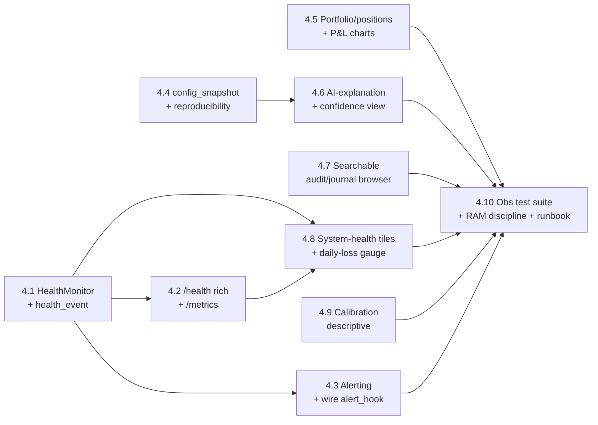

# Epic 4 — Observability Dashboard, Metrics & Alerting

> **Goal:** Make the running system **observable and safely operable from a distance.**
> Epic 3 gave the operator a thin *supervisory* surface (review the decision journal, tune,
> e-stop) and a read-only positions/P&L + health-badge summary. Epic 4 builds the **rich
> observability layer on the same API + DB**: a `HealthMonitor` that turns each cycle into
> durable `health_event` rows, `/health` + `/metrics` endpoints, **alerting** (email/webhook,
> severity-gated), interactive portfolio/positions/P&L charts, an **AI-explanation & confidence**
> view over the (now fully persisted) provenance chain, a **searchable log/audit browser**, and
> per-cycle **config snapshots** for reproducibility. The operator can watch the system, get
> paged when something is wrong, and understand *why* it did what it did — all over the same
> private network Epic 3 established.
>
> This is Phase 4 of the [roadmap](../12-roadmap.md). It implements
> [10 — Observability, Logging & Alerting](../10-observability.md) in full and builds directly on
> Epic 3's `clav-web` app, control API, and persisted domain records. **Still paper-only. Live
> trading remains Epic 6.**
>
> The defining principle is unchanged from the roadmap: **ship observability before capability.**
> It is always correct to have a system that trades conservatively and explains itself; Epic 4 is
> the "explains itself, out loud, and pages you when it can't" layer that must exist before any
> live-money capability (Epic 6) is contemplated.

## Resolved design decisions

These were the open questions when Epic 4 was scoped; they are settled here so the stories are
unambiguous. Revisit them explicitly if the product direction changes.

1. **Dashboard stack — `server-rendered HTML + HTMX, no SPA` (carried from Epic 3, decision #7).**
   Charts are **inline SVG** rendered server-side (or a single tiny vendored, dependency-free JS
   charting helper embedded in a template) — **no Node/webpack/React build step**, nothing fetched
   from a CDN at runtime. This keeps the 2 GB Pi light and the surface auditable. (Rejected: a
   React/Recharts SPA — overkill and a build-chain liability on ARM.)
2. **Metrics format — `Prometheus text exposition at /metrics`, plus a JSON `/health`.** `/metrics`
   emits the standard Prometheus text format so a future scraper (Grafana/Prometheus on another
   box) can consume it without CLAV shipping a time-series DB itself; `/health` stays a
   human/JSON liveness+summary endpoint (extended from Epic 3's). CLAV **does not** run its own
   Prometheus/Grafana — the Pi exposes metrics; scraping/retention is off-box and optional.
   (Rejected: a bundled TSDB — RAM/disk cost the Pi can't spare.)
3. **`HealthMonitor` ownership — `clav-core writes, clav-web reads`.** The monitor runs **inside
   `clav-core`** each cycle (it needs the live broker/analyst/portfolio state) and writes
   `health_event` rows + a compact `system_control` snapshot, exactly like Epic 3's
   `llm_budget_snapshot` pattern. `clav-web` **only reads** those rows/snapshots to render — it
   never runs trading logic or holds broker keys (the two-processes/one-DB invariant holds).
4. **Alerting — `pluggable channels, off-by-default, severity-gated`.** A small `Alerter`
   abstraction with email (SMTP) and webhook (ntfy/Telegram) adapters, wired into the **existing
   `alert_hook` seam** (currently unwired). `CRITICAL` pages immediately; `WARNING` batches into a
   periodic digest. Every alert is also a `health_event` row, so history is visible in the
   dashboard even with no channel configured. All channels are **off by default** (config/secrets
   absent ⇒ alerts still log + persist, just don't send) — consistent with Epic 3's free-tier,
   no-required-keys stance.
5. **Log browsing — `audit/domain events from the DB, not a full log-file grep`.** The dashboard's
   "searchable view" is over the **durable DB records** (`audit_log`, `health_event`, `decision`/
   `risk_evaluation`/`trade_proposal`, joined by `cycle_id`), not a general-purpose log-file
   search engine. Verbose structured file logs (docs/10 §1) stay on disk/journald for
   `jq`/`journalctl`; the UI surfaces the *authoritative* journal, filterable by
   `cycle_id`/symbol/severity. (Rejected: shipping a log-file indexer — scope creep + RAM.)
6. **Calibration scope — `descriptive now, full calibration in Epic 5`.** Epic 4 ships the
   *inputs* to calibration (per-decision conviction/sentiment from `analysis_result`, joined to
   the driving `trade_proposal`/`order`) and a **descriptive** "conviction vs. realized P&L"
   scatter/summary for **closed** trades. The **structured trade-review retrospective** and
   score-calibration analytics proper are **Epic 5** (`TradeReviewService`), built on the same
   joins. Epic 4 does not add a review worker.
7. **Audience — `plain-language front, operator detail behind a menu` (redesign follow-up).**
   The dashboard serves two audiences from the same DB. The **forward-facing** pages (Home,
   Watchlist, Activity) are for someone who is not fluent in trading-bot vocabulary: no
   `raw_score`, `conviction band`, `drawdown`, or `portfolio bias` on the surface — signed
   scores are translated to words ("Price trending up", "Positive news mood", "Confidence:
   High") by a single presentation layer (`clav/web/plain_language.py`) and drawn as bars. Every
   operator control and every raw number stays reachable, but **behind progressive disclosure**:
   the nav's **Advanced ▾** menu and per-page "Advanced: …" `
` blocks. No data is
   removed — the full provenance chain still renders verbatim inside the disclosures, so the
   operator surface and the tests over it are unchanged. Charts gain a hover crosshair (the one
   dependency-free JS helper decision #1 already permits); a native `<datalist>` powers
   watchlist autocomplete. (Rejected: a separate "simple mode" app or a second DB view — the
   translation is pure presentation, so one template tree with two tiers is simpler and cannot
   drift from the real numbers.)

## Where Epic 3 left off

Epic 3 delivered the foundation Epic 4 builds on — and deliberately stopped at the supervisory
surface:

- **`clav-web` exists**: a FastAPI app (separate process, same SQLite/WAL DB), router/template
  pattern, Jinja + HTMX, an optional shared-token auth on state-changing routes, and a systemd
  unit. Epic 4 adds routers/templates; it does not re-architect.
- **`GET /health` exists but is thin**: it returns emergency-stop/paused, the last `scan_cycle`,
  and the Gemini breaker/budget snapshot — no per-ticker freshness, no system RSS/CPU/disk, no
  trading counters, and there is **no `/metrics`**.
- **No `HealthMonitor` and no `health_event` table.** docs/08 and docs/10 spec both; neither is
  built. Epic 3's `/health` is a lightweight read-model, not the monitor.
- **The `alert_hook` seam is unwired.** `ScanCycleService`/`ExecutionEngine` accept an
  `alert_hook` callback, but the composition root passes `None`, so daily-loss/e-stop/execution
  alerts currently only log. No channel implementation exists.
- **No `config_snapshot` persistence.** `Settings.to_snapshot_dict()` exists (redacted, JSON) but
  is never called to persist a per-cycle snapshot; docs/10 §5 reproducibility depends on it.
- **The provenance chain is complete and queryable**: `news_item` / `social_digest` →
  `analysis_result` (the exact redacted Gemini request/response) → `prompt_version` → `decision`
  → `risk_evaluation` → `trade_proposal` → `order`, joined by ids (the `analysis_result_id`
  back-link lives in `decision.reasoning.llm` and `trade_proposal.inputs_ref`). Epic 4's
  AI-explanation view reads straight off this — no new capture plumbing needed.
- **Time-series already accumulate**: a `portfolio_snapshot` per cycle (equity/cash/exposure/
  drawdown/sector) and an `audit_log` row on every control action. Epic 4's charts and audit
  browser render existing rows.

## Epic-level definition of done

- A **`HealthMonitor`** runs each cycle inside `clav-core` and writes durable `health_event` rows
  covering: **freshness** (age of latest quote/indicator/news/social per ticker), **external
  services** (Alpaca / Gemini / each news+social source: success/error, breaker state, LLM latency
  + token spend vs. budget), **system** (process RSS, free memory, CPU load, SSD free, DB + WAL
  size), **trading** (cycles completed, decisions by action, orders submitted/filled/rejected,
  current drawdown, daily P&L vs. the daily-loss cap), and **liveness** (last successful cycle ts).
- **`GET /health`** (extended) and **`GET /metrics`** (Prometheus text) expose the above; a stale
  liveness value is unambiguous ("core is stuck/dead"). Both are served by `clav-web`, read-only.
- **Alerting** fires on the docs/10 §3 conditions (e-stop tripped, daily-loss cap hit, broker
  auth failure, reconciliation failure, no successful cycle in > N minutes during market hours,
  disk/memory pressure, token budget exhausted) via **pluggable, off-by-default** email/webhook
  channels wired to the existing `alert_hook`; every alert is also a `health_event` row.
  `CRITICAL` pages immediately, `WARNING` digests.
- A **dashboard** (HTMX, no SPA build) renders from the DB: portfolio & positions with **P&L /
  equity / drawdown charts** (inline SVG), **recent trades with their AI explanation +
  confidence** (the full provenance chain, incl. the exact `analysis_result`), per-ticker latest
  analysis, **system-health tiles** (freshness / breakers / memory / disk), a **daily-loss
  gauge**, and a **searchable audit/journal view** filterable by `cycle_id`/symbol/severity.
- **Reproducibility**: a **`config_snapshot`** row (effective redacted config + git SHA) is
  persisted per cycle; combined with the append-only decision/analysis tables, any historical
  decision can be replayed and explained.
- **Same access model as Epic 3**: private-network-bound (LAN/localhost or Tailscale), optional
  token; nothing new is exposed publicly. Because the log/audit view surfaces more than the Epic-3
  journal, the token-hardening question is explicitly **revisited** (decision below in Risks).
- **Everything still runs on free infrastructure** — no bundled TSDB, no paid dashboard host; the
  Pi exposes `/metrics` for optional off-box scraping. A fresh clone with no paid keys still runs
  the full loop **and** the dashboard.
- **CI**: dashboard smoke tests (TestClient render + filter round-trips), `HealthMonitor` unit
  tests (with `FakeClock`/fake psutil), a `/metrics` format test, alerting-trigger property tests
  (each condition fires exactly its severity, and a missing channel never raises), and a
  RAM-discipline guard (dashboard queries are paginated/bounded — no full-history load).

## Epic-level acceptance demo

Start `clav-core` + `clav-web` on a seeded paper DB. Show: the dashboard home with live
system-health tiles (freshness, memory/disk, Alpaca/Gemini breaker badges), the equity/drawdown
chart drawn from `portfolio_snapshot` history, and a daily-loss gauge approaching its cap. Open a
recent trade and read its **AI explanation** — the exact Gemini prompt + response
(`analysis_result`), sentiment/conviction, the news/social that drove it, and the risk outcome —
then the closed-trade **conviction-vs-P&L** summary. Filter the audit view by a `cycle_id` and see
every control action + health event for that cycle. Trip the daily-loss cap in a seeded scenario
and watch a **CRITICAL alert** send (to a fake SMTP/webhook sink in the test) **and** land as a
`health_event` row visible on the dashboard; kill `clav-core` and watch the **liveness** tile go
red and a "no successful cycle" alert fire. Curl `/metrics` and see Prometheus-format gauges.
Show the whole run completing with **no paid keys and no external dashboard host configured**, and
the observability + smoke suites green in CI.

## Out of scope (deferred)

- **Trade-review retrospective + full score calibration** (a `TradeReviewService`/review worker
  that writes structured per-trade reviews and calibration analytics) → **Epic 5**. Epic 4 ships
  only the *descriptive* conviction-vs-outcome view over existing closed-trade data.
- **Live-money controls** — LIVE banner, flatten-on-estop live semantics, real-money alert
  routing/escalation → **Epic 6**.
- **A bundled Prometheus/Grafana/TSDB or a hosted dashboard.** Epic 4 exposes `/metrics`;
  scraping/retention/graphing off-box is the operator's optional choice, not shipped here.
- **A general log-file search engine.** The UI searches durable DB records; raw file logs stay on
  disk/journald for `jq`/`journalctl` (decision #5).
- **Mobile-native app / push notifications** beyond the webhook channel (ntfy handles phone push
  fine) → not built.

---

## Story map & sequencing

Rough size: **~26 points**. Critical path: 4.1 → 4.2 → 4.8 → (4.5 / 4.6 / 4.7) → 4.10. Stories 4.3,
4.4, and 4.9 are parallelizable after 4.1. **4.1 must land first** — the monitor + `health_event`
table are what every other observability story reads.

---

## Story 4.1 — `HealthMonitor` + `health_event` table · 3 pts
**As a** stakeholder **I want** each cycle's health captured as durable rows **so that** the
dashboard, metrics, and alerts all read one authoritative source rather than re-deriving state.

**Acceptance criteria**
- A `health_event` table + repo (matching [03 — Database](../03-database.md) conventions): `id,
  ts, category (freshness|external|system|trading|liveness), name, status (ok|warn|critical),
  value(json), cycle_id`.
- A `HealthMonitor` service runs inside `clav-core` at the end of each cycle (and on startup),
  writing `health_event` rows for: freshness (latest quote/indicator/news/social age per ticker),
  external services (Alpaca/Gemini/news/social success+breaker state, LLM latency + token spend
  vs. budget — reusing the Epic-3 `GeminiBudget.snapshot()`), system (process RSS, free memory,
  CPU load, SSD free, DB+WAL size — via `psutil` + a `PRAGMA page_count`), trading (cycles/
  decisions-by-action/orders by status/drawdown/daily-P&L-vs-cap), and liveness (last successful
  cycle ts).
- It writes a compact latest-state snapshot to `system_control` (`health_snapshot`), exactly like
  Epic 3's `llm_budget_snapshot`, so `clav-web` reads current health without recomputing.
- Time is via the injected `Clock`; system metrics via an injected collector (so tests stub
  `psutil`/disk without touching the real host). Bounded retention (keep last K per category) for
  Pi disk discipline.
- Never aborts a cycle: a metrics-collection failure logs `WARNING` and writes a `warn`
  `health_event`, never raises.

**Tasks:** `health_event` model + migration + repo; `HealthMonitor` (freshness/external/system/
trading/liveness collectors); injected system-metrics collector; `health_snapshot` to
`system_control`; retention; wire into `ScanCycleService`; `FakeClock`/stubbed-collector tests.

---

## Story 4.2 — Rich `/health` + Prometheus `/metrics` · 2 pts
**As an** operator **I want** machine- and human-readable health/metrics endpoints **so that** I
can check liveness at a glance and (optionally) scrape metrics off-box.

**Acceptance criteria**
- `GET /health` (extends Epic 3's) returns the full `health_snapshot`: liveness, freshness
  summary, external-service/breaker state, system tiles, trading counters — JSON, human-friendly,
  read-only.
- `GET /metrics` emits **Prometheus text exposition format** for the same numeric series
  (gauges/counters: `clav_last_cycle_age_seconds`, `clav_drawdown_ratio`, `clav_daily_pnl_usd`,
  `clav_gemini_tokens_today`, `clav_orders_total{status=…}`, `clav_process_rss_bytes`,
  `clav_disk_free_bytes`, …). No external client library required beyond a tiny formatter (or
  `prometheus_client` if its footprint is acceptable — evaluated in this story).
- Both read only the `health_snapshot`/`health_event` rows written by 4.1 — `clav-web` computes
  nothing itself and holds no broker keys.
- A stale liveness value is representable and unambiguous (age since last successful cycle).
- Tests: `/health` payload shape; `/metrics` parses as valid Prometheus text; both reflect a
  seeded `health_snapshot`.

**Tasks:** extend health router; Prometheus formatter + `/metrics` route; metric naming/labels;
`TestClient` + format tests.

---

## Story 4.3 — Alerting (channels + wire the `alert_hook`) · 3 pts
**As an** operator **I want** to be paged when something is wrong **so that** I don't have to
watch the dashboard to stay safe.

**Acceptance criteria**
- An `Alerter` abstraction with **email (SMTP)** and **webhook (ntfy/Telegram)** adapters, all
  **off by default** (absent config/secrets ⇒ alerts still log + persist a `health_event`, never
  send, never raise).
- Wired into the **existing `alert_hook` seam** (now passed from the composition root, not `None`)
  plus the `HealthMonitor`, firing on the docs/10 §3 conditions: e-stop tripped, daily-loss cap
  hit, broker auth failure, reconciliation failure, **no successful cycle in > N minutes during
  market hours**, disk/memory pressure, token budget exhausted.
- **Severity-gated**: `CRITICAL` sends immediately; `WARNING` batches into a periodic digest
  (rate-limited so a flapping condition can't spam). Every alert is also a `health_event` row.
- Secrets (SMTP creds / webhook tokens) come from env/`.env` only, never YAML, never logged.
- Tests (fake SMTP + fake webhook sinks, `FakeClock`): each trigger condition fires exactly its
  severity; a missing/unconfigured channel logs + persists but never raises; digest batching +
  rate-limit windows; the "no cycle in N minutes during market hours" timer.

**Tasks:** `Alerter` + email/webhook adapters; config + secrets; wire `alert_hook` in composition
root; trigger conditions in `HealthMonitor`; severity gating + digest; fake-sink tests.

---

## Story 4.4 — `config_snapshot` + reproducibility · 2 pts
**As a** stakeholder **I want** the exact config that produced each cycle persisted **so that** any
historical decision can be replayed and explained months later.

**Acceptance criteria**
- A `config_snapshot` table + repo: `id, cycle_id, git_sha, config(json, redacted), created_at`.
- `ScanCycleService` persists one snapshot per cycle using the existing
  `Settings.to_snapshot_dict()` (secrets already redacted) plus the resolved runtime override
  (Epic 3's `RuntimeConfigStore`) so the *effective* config — not just boot config — is captured,
  and the current git SHA.
- Deduped/bounded: identical consecutive snapshots collapse (store a hash + reference) so an
  unchanged config across thousands of cycles doesn't bloat the DB; retention keeps a full history
  of *changes*.
- A closed decision joins to the `config_snapshot` active at its cycle, completing the docs/10 §5
  reproducibility chain alongside `analysis_result`.
- Tests: snapshot persisted per cycle; effective-override captured (not just boot config);
  consecutive-identical dedup; git SHA present; redaction holds (no secret leaks).

**Tasks:** `config_snapshot` model + migration + repo; git-SHA resolver; per-cycle persist +
dedup/retention; join to decision; redaction test.

---

## Story 4.5 — Portfolio / positions + P&L charts · 3 pts
**As an** operator **I want** to see equity, drawdown, exposure, and open positions over time
**so that** I can judge the system's trajectory at a glance.

**Acceptance criteria**
- A dashboard page rendering, from `portfolio_snapshot` history: an **equity curve**, a
  **drawdown chart**, current **gross/net exposure** and **sector allocation**, and the open
  **positions** table (symbol/qty/avg entry/stop/take-profit/unrealized P&L) — all **inline SVG**,
  server-rendered, **no SPA build, nothing CDN-fetched** (decision #1).
- Queries are **paginated/bounded** (e.g. last N snapshots, downsampled server-side) — never load
  full history into RAM (Pi discipline).
- Reads existing rows only; adds no write path. Same access model as Epic 3.
- Tests: page renders with seeded snapshots; empty-history renders gracefully; the query is
  bounded (asserts a limit is applied).

**Tasks:** portfolio router + template; inline-SVG chart helper (equity/drawdown); positions
table; server-side downsample/pagination; render + bound tests.

---

## Story 4.6 — AI-explanation & confidence view · 3 pts
**As an** operator **I want** each recent trade shown with the full "why" **so that** I can judge
whether the analyst is reasoning well — not just whether it made money.

**Acceptance criteria**
- A dashboard view listing recent decisions/trades, each expandable to the **full provenance
  chain** already persisted by Epic 3: the news/social inputs, the **exact** `analysis_result`
  (redacted Gemini request + response), `sentiment`/`conviction`/`prompt_version`/`model`, the
  risk outcome, and the resulting order/fill/realized P&L — joined by the `analysis_result_id` /
  `inputs_ref` back-links.
- A **confidence** presentation: per-decision conviction and whether it was a Gemini-driven vs.
  technical-only (`is_fallback`) signal, surfaced compactly per row.
- Read-only, paginated, filterable by symbol/action; no new capture plumbing (Epic 3's
  `analysis_result` already stores everything).
- Tests: a seeded closed trade renders its full chain incl. the exact prompt/response; a
  technical-only (fallback) decision renders clearly marked; pagination/filter round-trips.

**Tasks:** explanation router + template; provenance-join query (reuse Epic-3 repos); confidence
rendering; fallback marking; render + filter tests.

---

## Story 4.7 — Searchable audit / journal browser · 3 pts
**As an** operator **I want** to filter every control action and health event by cycle/symbol/
severity **so that** I can investigate an incident without SSHing in to grep logs.

**Acceptance criteria**
- A dashboard view over the **durable DB records** — `audit_log`, `health_event`, and the
  decision/risk/journal rows — filterable by `cycle_id`, symbol, category, and severity, ordered
  newest-first, **paginated** (decision #5: DB records, not a log-file grep).
- Every manual control action (from Epic 3's control API/UI) is already written to `audit_log`;
  this view surfaces them with before/after and actor.
- A one-click "reconstruct this cycle" filter shows the whole `cycle_id` story: config snapshot →
  decisions → risk evals → analysis → orders → health events → any alerts.
- Read-only; bounded queries (no unbounded scans). Verbose file logs stay on disk/journald and are
  linked-to (documented), not ingested.
- Tests: filter round-trips (cycle/symbol/severity); pagination bounded; a seeded incident
  reconstructs end-to-end.

**Tasks:** audit/journal router + template; combined filtered query across `audit_log`/
`health_event`/decision joins; `cycle_id` reconstruct view; pagination; filter tests.

---

## Story 4.8 — System-health tiles + daily-loss gauge + breaker badges · 2 pts
**As an** operator **I want** an at-a-glance status header **so that** I can tell in one second
whether the system is healthy.

**Acceptance criteria**
- The dashboard home renders, from the `health_snapshot` (4.1): **liveness** (green/red on last
  successful cycle age), **freshness** per critical source, **breaker/budget badges** (Alpaca,
  Gemini — reusing Epic 3's `llm_budget` shape), **system tiles** (RSS/free-mem/CPU/SSD-free/
  DB-size), and a **daily-loss gauge** (today's P&L vs. `max_daily_loss_pct`, colour-graded as it
  approaches the cap).
- Tiles degrade gracefully when a metric is missing (renders "unknown", not a crash), and the
  e-stop/pause state + Epic-3 controls remain prominent.
- Auto-refreshes via HTMX polling (a bounded interval), no full-page reload, no JS framework.
- Tests: tiles render from a seeded snapshot; missing-metric renders "unknown"; the daily-loss
  gauge colour thresholds; estop/pause state reflected.

**Tasks:** health-header partial + template; tile/gauge/badge components (inline SVG/CSS); HTMX
poll; graceful-missing rendering; render tests.

---

## Story 4.9 — Descriptive calibration view (conviction vs. outcome) · 2 pts
**As a** stakeholder **I want** to see whether high-conviction calls actually paid off **so that**
I can decide if the analyst is worth its weight — ahead of the full Epic-5 review.

**Acceptance criteria**
- A dashboard view joining **closed** trades to the `analysis_result`/`decision` that drove them:
  a conviction-vs-realized-P&L scatter (inline SVG) + a bucketed summary table (e.g. mean return
  by conviction band, hit-rate by band, Gemini-driven vs. technical-only).
- Explicitly **descriptive**, not a scored calibration model — reads existing rows, adds no review
  worker (decision #6; the structured retrospective is Epic 5).
- Handles small/empty samples gracefully (shows counts, doesn't over-claim).
- Tests: buckets/hit-rate computed correctly over seeded closed trades; empty/small sample renders
  without dividing by zero.

**Tasks:** calibration query (closed-trade ↔ analysis join); bucketing/hit-rate math; scatter +
summary template; small-sample handling; math tests.

---

## Story 4.10 — Observability test suite, RAM discipline & runbook · 3 pts
**As a** stakeholder **I want** the dashboard proven light and correct, and the new surface
documented **so that** Epic 4 is trustworthy and operable on the Pi.

**Acceptance criteria**
- **RAM/bound discipline (property/guard tests):** every dashboard query is paginated/bounded and
  every chart is downsampled server-side — a test asserts no route loads unbounded history (e.g.
  seed 10k snapshots, assert the equity route reads ≤ the configured cap).
- **Alerting invariants (property tests):** each trigger condition fires exactly its severity; a
  missing/unconfigured channel never raises; digest rate-limits hold; secrets never appear in a
  rendered alert or log.
- **Smoke tests:** every dashboard page + partial renders via `TestClient` (incl. empty-DB and
  missing-metric states) and filter/poll round-trips work with **JavaScript off** (HTMX is
  enhancement only).
- CI gate: observability + smoke suites required; coverage stays high on `HealthMonitor`, the
  alerter, and the new routers.
- README/docs: a **Phase 4 runbook** — starting the dashboard, reading each view, configuring
  alert channels (SMTP/webhook, off by default), pointing an off-box Prometheus at `/metrics`,
  what each health tile/alert means and how to respond, and how `config_snapshot` +
  `analysis_result` make a decision reproducible. `config.example.yaml`/`.env.example` updated
  with the new (all-optional) keys.

**Tasks:** RAM-bound guard tests; alerting property tests; dashboard smoke tests; CI wiring;
README Phase-4 runbook; example config/env updates.

---

## Dependencies & risks

- **Hard dependency on Epic 3.** Epic 4 is built on `clav-web`, the control API, the persisted
  domain records (`portfolio_snapshot`, `audit_log`, `trade_proposal`, `analysis_result`), and the
  `system_control` snapshot pattern. All of that exists; Epic 4 is unblocked. It must **not** pull
  Epic 5 (trade-review worker) or Epic 6 (live controls) forward — decision #6 and Out-of-scope.
- **Pi RAM (2 GB) is the dominant constraint.** Charts, a metrics endpoint, and a log/audit
  browser can each blow memory if they load history. Everything paginates/downsamples
  server-side; no bundled TSDB; `/metrics` is exposed for *off-box* scraping. Story 4.10's guard
  tests exist to keep this honest. `psutil` is the one new runtime dep worth vetting on ARM (it's
  small and wheels exist on piwheels).
- **No SPA build chain (carried invariant).** Charts are inline SVG or one tiny vendored helper;
  nothing is fetched from a CDN at runtime (the Epic-3 CSP/offline stance). A React dashboard is
  explicitly rejected (decision #1).
- **Two processes, one DB (carried invariant).** `HealthMonitor` runs in `clav-core` (it needs
  live broker/analyst/portfolio state) and writes rows; `clav-web` only reads. The web process
  still never runs trading logic or holds broker keys.
- **Auth surface grows — revisit the token default.** Epic 3's optional token is off by default
  for a single LAN operator (decision #7), acceptable for a review/tune surface. Epic 4's
  **log/audit browser** exposes more (health, audit trail, full rationales). Decision to make in
  4.7: whether the audit/log views alone should default the token *on*, or stay bound to the
  private-network-is-the-gate model until Epic 6 hardens auth for live money. Flag for review
  before shipping the log browser.
- **Alert fatigue & secrets.** Severity gating + digest batching + rate-limiting are load-bearing:
  a flapping condition must not page repeatedly. Alert channel secrets are env-only and never
  logged/rendered (Story 4.3/4.10 test this). All channels off by default keeps the free-tier,
  no-required-keys guarantee.
- **Metrics cardinality.** Per-ticker/per-source labels on `/metrics` must stay bounded (watchlist
  size, not unbounded symbols) so a scraper isn't overwhelmed and the Pi doesn't hold a large
  registry.
