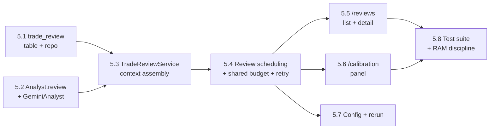

# Epic 5 — Trade Review Journal & Score Calibration

> **Goal:** Give every **closed** paper trade a structured, LLM-written post-mortem, and turn
> the accumulating journal into a signal for whether the analyst's confidence is trustworthy.
> Epic 4 shipped a *descriptive* conviction-vs-P&L scatter as a stopgap; Epic 5 ships the real
> thing: a **`TradeReviewService`** that asks Gemini *why a trade played out the way it did*, a
> durable **`trade_review`** record per closed trade, and dashboard views that aggregate tags,
> misleading signals, and confidence-calibration verdicts across history.
>
> This is Phase 5 of the [roadmap](../12-roadmap.md). It implements
> [07 — Trade Review System](../07-trade-review.md) in full, closes the provenance chain in
> [03 — Database](../03-database.md) (`… → trade → trade_review`), and adds the `Analyst.review()`
> port already drawn in [05 — Class Design](../05-class-design.md). **Still paper-only.** Reviews
> are read-only documentation — they never place, size, or veto a trade. Live trading is Epic 6.

## Resolved design decisions

Open questions at scoping time, settled here so the stories are unambiguous. Revisit explicitly
if the product direction changes.

1. **The review "queue" is a status column on `trade`, not a new table.**
   [07 §1](../07-trade-review.md#1-trigger--flow) sketches a `ReviewQueue`; in practice a
   denormalized `trade.review_status` (`pending | reviewed | failed`) is enough — a pass is just
   `WHERE status='closed' AND review_status='pending'`, a single indexed lookup. No separate
   queue table, no dequeue/ack bookkeeping, nothing to lose on a crash: a restart re-runs the
   same query. (Rejected: a durable `review_queue` table, which would reinvent state the trade
   row already carries.)
2. **`TradeReviewService` runs inside `clav-core`, as a separate scheduled job.** Reviewing means
   calling Gemini, and only `clav-core` holds the LLM key and the `GeminiBudget`/breaker (Epic 3).
   It gets its own `APScheduler` entry alongside `scan_cycle`/`daily_reset`, deliberately **off
   the trading hot path** — a slow or exhausted review pass never delays a scan cycle. `clav-web`
   only reads `trade_review` rows (two-processes/one-DB invariant holds).
3. **Reviews share the analysis budget/breaker, and defer rather than degrade.**
   [07 §5](../07-trade-review.md#5-cost-control) puts reviews under the same budget as analysis,
   so `TradeReviewService` gets the **same `GeminiBudget` instance** the `AnalystGateway` uses —
   one daily ceiling, one breaker, no second free-tier allowance to size. But unlike `analyze()`,
   a review has **no safe neutral fallback** (a fabricated post-mortem would be worse than none),
   so an open breaker or spent budget **defers** the trade to a later pass instead of writing a
   degraded review.
4. **Exit reason is derived, not stored.**
   [07 §2](../07-trade-review.md#2-context-assembled-for-the-review) wants the exit reason as
   context; no `exit_reason` column is added. `trade.exit_order_id → order.decision_id → decision`
   plus `risk_evaluation.notes.source == "stop_monitor"` already distinguish a stop-monitor exit
   (Story 2.4) from a risk-approved SELL, and `trade_proposal.status` marks a rejected/expired
   approval-mode entry. The service derives a compact `exit_reason` label from these joins.
5. **Failed reviews retry with capped backoff, then land in a terminal state.** A genuine failure
   (timeout, or malformed JSON surviving the repair path) increments `trade.review_attempts` and
   is retried on a later pass with exponential backoff; at `review.max_attempts` (default 5) the
   trade flips to `review_status='failed'` and drops out of future passes, shown in the journal as
   "review failed" — never silently retried forever, never fabricated. (Budget/breaker deferrals
   from decision #3 are **not** failures and don't count toward the cap.)
6. **Reviews are append-only; re-review is a manual DB flip, not a background job.**
   [07 §4](../07-trade-review.md#4-turning-reviews-into-learning) requires immutable history. The
   scheduled pass only touches `review_status='pending'` trades. A manual
   `POST /api/reviews/{trade_id}/rerun` simply resets that trade to `pending` (attempts → 0); the
   next `clav-core` pass writes an **additional** `trade_review` row rather than updating the old
   one. The journal renders the newest row as current with prior ones retained. No automatic
   re-review is scheduled — deciding *when* a past review is stale is out of scope.
7. **Keep Epic 4's quantitative calibration page; add a separate qualitative one.** `/calibration`
   (Story 4.9) stays as-is — an LLM-cost-free conviction-vs-P&L scatter from `decision`/`trade`.
   Epic 5 adds `/reviews` for the qualitative journal, and extends `/calibration` with one panel
   over the LLM's own `confidence_calibration` verdict. The two answer different questions ("did
   high conviction pay off" vs. "was the model's self-assessment right"); reading one shouldn't
   depend on the other.

## Where Epic 4 left off

- **No `trade_review` table.** [03 — Database](../03-database.md) specs the shape, and
  `src/clav/data/tables.py`'s own comment says it "arrives with the epic that uses it (Epic 5)" —
  this one.
- **No `Analyst.review()`.** `src/clav/interfaces/analyst.py` defines only `analyze()`;
  [05 — Class Design](../05-class-design.md) already shows `+review(trade, context)`. Epic 5
  implements it on `GeminiAnalyst`, reusing the strict-JSON + repair machinery in
  `integrations/llm/analyst.py` / `client.py` rather than inventing a second LLM path.
- **No `TradeReviewService`.** `docs/08-project-structure.md` reserves
  `src/clav/services/review.py`; the file doesn't exist yet.
- **The `trade` table is already review-ready.** `Trade` (`entry_price`, `exit_price`,
  `realized_pl`, `return_pct`, `status`) plus `entry_decision_id`/`entry_order_id`/`exit_order_id`
  let a review walk back to `decision → risk_evaluation → analysis_result → news_item/social_digest`
  and forward to the closing `order`/`fill`. Entry capture needs no change.
- **`GeminiBudget`/breaker (Epic 3) is reused wholesale** — no new cost-control mechanism.

## Epic-level definition of done

- A **`trade_review`** table + repo persist one row per (trade, review pass): `why_entered`,
  `supporting_info`, `risks_at_entry`, `reasoning_correct` (bool, nullable), `what_worked`,
  `misleading_signals`, `hindsight_view`, `improvements`, `confidence_calibration`
  (`overconfident|calibrated|underconfident`), `tags`, plus `model`, `raw_response` (redacted, like
  `analysis_result`), and `created_at`. Append-only.
- **`Analyst.review(trade, context) -> TradeReview`** on the interface and `GeminiAnalyst`: strict
  JSON validation with the existing repair path. On any failure it **raises a typed error** (there
  is no safe neutral review, decision #3) for the service to handle — it never returns a fabricated
  review and never leaks an exception into the trading loop.
- A **`TradeReviewService`** (`services/review.py`) runs as a separate `clav-core` job: finds
  `review_status='pending'` closed trades, assembles context (entry decision/risk/analysis/news/
  social, the price path from `candle` rows between open and close, and the derived exit reason),
  calls `review()` under the shared budget/breaker, and persists the result — deferring on a spent
  budget, retrying-then-terminally-failing on a genuine error. It **never** blocks `ScanCycleService`.
- The review job runs on its **own configurable interval**, defaulting off-peak so it doesn't
  compete with market-hours scan-cycle Gemini calls for the shared budget
  ([07 §5](../07-trade-review.md#5-cost-control)).
- A **`/reviews`** dashboard view (list + detail) renders each review beside a link to its entry
  provenance (`/explanations/{decision_id}`, Epic 4) — read-only, paginated, filterable by
  symbol/tag/verdict.
- **`/calibration`** gains one panel aggregating `confidence_calibration` verdicts and
  `tags`/`misleading_signals` frequency against realized outcome — descriptive, no scored model.
- An operator can force a **manual re-review** (`POST /api/reviews/{trade_id}/rerun`), which
  appends a new immutable row (decision #6).
- **A fresh clone with no Gemini key still runs**: the review job defers everything, `/reviews`
  shows an empty state, nothing crashes.
- **CI**: `TradeReviewService` unit tests (context assembly, exit-reason derivation, defer vs.
  retry-vs-terminal-fail transitions, budget-sharing) with `FakeClock`/fakes; `GeminiAnalyst.review()`
  failure tests (malformed/timeout/safety-block → typed error, same chaos shape as Epic 3's
  `analyze()`); `/reviews` + `/calibration`-panel smoke tests (incl. empty and pending/failed
  states); and a RAM-discipline guard that the journal queries are bounded.

## Epic-level acceptance demo

Seed a paper DB with several closed trades (winners, losers, one stop-monitor exit, one
technical-only entry). Start `clav-core` with a short review interval and `clav-web`. Watch a
review pass pick up each pending trade, call Gemini, and persist a `trade_review` (or, with no key,
defer and log why). Open `/reviews`, read a post-mortem beside its entry rationale. Open
`/calibration` and see the new panel: `overconfident`/`calibrated`/`underconfident` against
realized P&L, plus a tag-frequency table. Force a re-review and watch a **second**, dated row
appear without the first disappearing. Kill the Gemini key mid-run: no exception, trading loop
untouched, the affected trade shows pending rather than silently skipped. Suites green in CI.

## Out of scope (deferred)

- **Auto-tuning from review aggregates** (a backtest-gated runner proposing weight/threshold
  changes) → **Phase 7 / [Future Expansion](../14-future-expansion.md)**. Epic 5 surfaces the
  aggregates; a human still turns the knobs via Epic 3's `/config`.
- **Scheduled/automatic re-review** — only a manual rerun ships (decision #6).
- **Live-money controls** → **Epic 6**.
- **A new `exit_reason` column** — derived from existing joins (decision #4).

---

## Story map & sequencing



Rough size: **~22 points**. Critical path: 5.1/5.2 → 5.3 → 5.4 → (5.5 / 5.6) → 5.8. Story 5.7 is
parallelizable once 5.4 lands.

---

## Story 5.1 — `trade_review` table + repository · 2 pts
**As a** stakeholder **I want** each review persisted as a durable, append-only row **so that**
the journal survives restarts and history is never overwritten.

**Acceptance criteria**
- `trade_review` table + migration (the DoD shape above), matching
  [03 — Database](../03-database.md) conventions.
- `trade.review_status` (`pending|reviewed|failed`, default `pending`) and `trade.review_attempts`
  (int, default 0) columns + migration, so the pass query is a single indexed lookup (decisions
  #1/#5).
- `TradeReviewRepository`: `insert`, `list_for_trade` (newest-first, for the history view),
  `list_recent(limit, filters)` for the dashboard, and the aggregation helpers Story 5.6 needs
  (`tag_frequency`, `calibration_verdict_counts`).
- `TradeRepository.list_pending_reviews(limit)`: `status='closed' AND review_status='pending'`.
- Tests: migration round-trip on temp SQLite; repo CRUD; the pass query excludes reviewed/failed
  trades; a second insert for one `trade_id` doesn't remove the first (append-only).

**Tasks:** model + migration; `trade` status/attempts columns + migration; repository; pass query;
repo tests.

---

## Story 5.2 — `Analyst.review()` + `GeminiAnalyst` · 3 pts
**As a** stakeholder **I want** the analyst to write a structured post-mortem in the exact schema
the journal expects **so that** every review is machine-parseable and a bad response never poisons
the journal.

**Acceptance criteria**
- `Analyst.review(trade, context) -> TradeReview` on `interfaces/analyst.py`, with new
  `ReviewContext`/`TradeReview` Pydantic models matching
  [07 §3](../07-trade-review.md#3-questions-the-review-answers): `reasoning_correct` nullable,
  `confidence_calibration` a three-value enum.
- `GeminiAnalyst.review()` builds the prompt from persona + context (reusing the
  `PromptVersionRepository`/persona wiring `analyze()` uses) and the same `GuardedLLMClient` path.
  On **any** failure (timeout, safety block, malformed JSON after repair, enum/range-invalid field)
  it raises a typed `ReviewError` — it does **not** fabricate a neutral review (decision #3); the
  caller decides defer vs. retry.
- Each call is offered to the same `ProvenanceSink` as `analyze()`, so a success lands its redacted
  request/response in `trade_review.raw_response` and a failure is logged, not persisted.
- Tests: valid response parses; malformed JSON / bad enum / safety block / timeout each raise
  `ReviewError` (never an unhandled exception, never a silent neutral review); the prompt includes
  the context fields.

**Tasks:** `ReviewContext`/`TradeReview` models; abstract `review()`; review prompt; `GeminiAnalyst.review()`
+ `ReviewError`; provenance wiring; tests.

---

## Story 5.3 — `TradeReviewService` context assembly · 3 pts
**As a** stakeholder **I want** each review built from the full provenance chain **so that** Gemini
has what a human analyst would want before judging the trade.

**Acceptance criteria**
- `TradeReviewService.build_context(trade) -> ReviewContext` gathers: the entry `decision` +
  `risk_evaluation`, the `analysis_result`(s) and exact `news_item`/`social_digest` that fed the
  entry, the price path from `candle` rows between `opened_at`/`closed_at`, realized P&L/return, and
  the derived `exit_reason` (decision #4).
- Read-only and bounded (capped candles/news per trade — Pi RAM discipline).
- Degrades gracefully on partial provenance (a stop-monitor exit has no exit-side
  `analysis_result` — expected, not an error).
- Tests: a full-chain trade yields a complete context; a stop-monitor exit derives
  `exit_reason="stop_monitor"`; a technical-only (`is_fallback`) entry is reflected; candle/news
  pulls are bounded.

**Tasks:** `build_context`; provenance joins (reuse Epic 3/4 repos); exit-reason derivation;
bounded fetch; tests.

---

## Story 5.4 — Review scheduling, shared budget, retry & terminal failure · 3 pts
**As an** operator **I want** reviews to run automatically without risking the trading loop or the
LLM budget **so that** the journal fills in on its own, safely.

**Acceptance criteria**
- A new `APScheduler` job runs `TradeReviewService.run_pass()` on `review.interval_minutes`,
  separate from `scan_cycle`/`daily_reset`, `max_instances=1`, never blocking the scan job.
- Each pass pulls `list_pending_reviews()`, and per trade builds context (5.3) and calls `review()`
  under the **shared** `GeminiBudget`/breaker (decision #3): a spent budget / open breaker
  **defers** (status untouched, no attempt counted); success writes the `trade_review` row and sets
  `review_status='reviewed'`.
- A `ReviewError` (Story 5.2) increments `review_attempts` with exponential backoff; at
  `review.max_attempts` the trade flips to `failed` and is logged at `warning` (decision #5).
- The job has **no path to submit an order**; a per-trade exception is caught and logged and the
  pass continues to the next trade.
- Tests (`FakeClock`, fake `Analyst`/`GeminiBudget`): a full pass reviews every pending trade; a
  spent-budget pass defers without counting attempts; a repeated `ReviewError` reaches
  `max_attempts` and terminally fails; one trade's exception doesn't halt the pass; the job never
  runs inside/blocking a scan cycle.

**Tasks:** `run_pass()`; scheduler wiring; shared-budget integration; retry/backoff + attempt
counter; terminal-fail transition; per-trade isolation; tests.

---

## Story 5.5 — `/reviews` dashboard: list + detail · 3 pts
**As an** operator **I want** to read each trade's post-mortem beside its entry rationale **so
that** I can judge whether the analyst reasons well, not just whether it made money.

**Acceptance criteria**
- `web/routers/reviews.py` + templates: a paginated list (`/reviews`, filterable by
  symbol/tag/`confidence_calibration`) and a detail page (`/reviews/{trade_id}`) showing the full
  review, with a link to `/explanations/{decision_id}` (Epic 4) for the entry side — no duplicate
  rendering of what Epic 4 already shows.
- `review_status in {pending, failed}` renders distinctly ("review pending" / "review failed after
  N attempts"), never a blank that looks like a bug.
- A re-reviewed trade shows all rows, newest first, dated (decision #6).
- Read-only, paginated, bounded.
- Tests: seeded review renders; pending/failed states render distinctly; a re-reviewed trade shows
  both rows; filter/pagination round-trips.

**Tasks:** router + list/detail templates; pending/failed rendering; filter/pagination; link to
`/explanations`; tests.

---

## Story 5.6 — `/calibration` panel: verdicts & tags · 2 pts
**As a** stakeholder **I want** to see whether the model's stated confidence was actually right,
and which tags recur **so that** I can judge the analyst's self-awareness, not just its numeric
conviction.

**Acceptance criteria**
- Extends `web/calibration.py` / `calibration.html` (Story 4.9) with one panel sourced from
  `trade_review` (kept visually distinct from the existing `decision`-based scatter — decision #7):
  an `overconfident`/`calibrated`/`underconfident` breakdown against realized P&L/hit-rate, and a
  tag/misleading-signal frequency table.
- Small/empty samples render an empty state, not an error (matching Story 4.9).
- Read-only, bounded, reusing the Story 5.1 aggregation helpers.
- Tests: verdict breakdown and tag frequency correct over seeded reviews; empty/small sample
  renders without dividing by zero.

**Tasks:** aggregation query; verdict/tag math; template panel; empty-state handling; tests.

---

## Story 5.7 — Config knobs + manual re-review endpoint · 1 pt
**As an** operator **I want** to tune the review cadence and force a re-review **so that** the
feature fits my schedule and I'm not stuck with a stale review.

**Acceptance criteria**
- A `review:` block in `config.example.yaml` (commented, all-optional): `interval_minutes`
  (default off-peak, e.g. `120`), `max_attempts` (default `5`), `backoff_base_seconds` /
  `backoff_max_seconds`.
- `POST /api/reviews/{trade_id}/rerun` (same shared-token auth as other state-changing routes) is a
  **DB-only** flip of `review_status` back to `pending` (attempts → 0); `clav-core`'s next pass
  does the Gemini call and appends a new row. `clav-web` never gains a Gemini key (decision
  #2/#6) — so there is no inline-call variant.
- All knobs optional; defaults still run a fresh clone.
- Tests: defaults load; the rerun endpoint re-queues a trade (and a later pass appends a second row
  without deleting the first); auth-gated like other state-changing routes.

**Tasks:** `review:` config + `Settings` fields; rerun endpoint (status flip only); config/endpoint
tests.

---

## Story 5.8 — Test suite, CI & RAM discipline · 3 pts
**As a** stakeholder **I want** Epic 5 proven safe and light **so that** it's trustworthy and
operable on the Pi like every prior epic.

**Acceptance criteria**
- **Chaos suite** (mirroring Epic 3's): every `review()` failure mode leaves a concurrently-running
  fake scan cycle trading normally — the review path is provably isolated from the trading loop.
- **RAM/bound guard:** seed a large `trade_review` history and assert `/reviews` and the
  `/calibration` panel read a bounded slice, never the whole table.
- **Smoke tests:** `/reviews` list/detail and the `/calibration` panel render via `TestClient`,
  including empty-DB and pending/failed states.
- CI gate: new suites required; coverage stays high on `services/review.py` and
  `GeminiAnalyst.review()` (matching the `domain/risk` bar).
- README/docs: a **Phase 5 runbook** (starting/tuning the review job, reading a `trade_review` row,
  forcing a re-review, what `review_status=failed` means) beside the Epic 1–4 sections;
  `config.example.yaml` updated.

**Tasks:** chaos tests; RAM-bound guards; smoke tests; CI wiring; README runbook; example config.

---

## Dependencies & risks

- **Hard dependency on Epics 2–4** (`decision`/`risk_evaluation`/`analysis_result`, the
  `GeminiBudget`/breaker, and the dashboard's routing/pagination conventions). All exist; Epic 5 is
  unblocked. It must not pull Epic 6 or the auto-tuning runner forward (see Out of scope).
- **The shared budget really is shared.** Review calls draw on the same daily cap as entry analysis
  (decision #3), so a heavy trading day could pit reviews against entry analysis. The off-peak
  default interval (5.7) and defer-don't-fail behavior (5.4) are load-bearing — get the default
  wrong and one side silently starves. Worth a real-budget sanity check once both paths are live.
- **The journal is a permanent record with no pruning** (unlike `health_event`), by design
  ([07 §4](../07-trade-review.md#4-turning-reviews-into-learning)). Dashboard queries stay bounded
  (5.8); if the table grows huge over years, revisit an archive/export path — not built here.
- **Carried invariants hold.** No SPA/CDN (server-rendered HTML/HTMX, like every Epic 4 page); two
  processes / one DB (`TradeReviewService` in `clav-core`, the rerun endpoint a DB-only flip from
  `clav-web`).
- **A review is documentation, never a control signal — enforce it by construction.** Nothing in
  the review path writes to `decision`, `risk_evaluation`, `system_control`, or anywhere
  `ScanCycleService`/`RiskEngine` read. This is the same advisory-only rule as
  [14 — Future Expansion](../14-future-expansion.md)'s closing constraint, and Story 5.8 asserts it
  (an import-linter/test check that review services have no write path into the decision tables),
  rather than leaving it a design intention.
```
