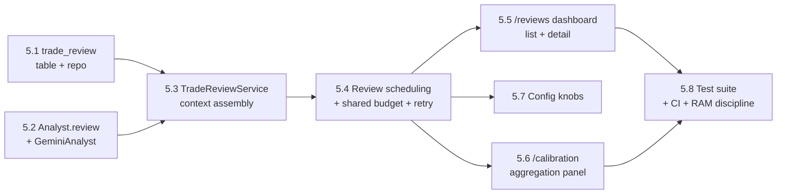

# Epic 5 — Trade Review Journal & Score Calibration

> **Goal:** Give every **closed** paper trade a structured, LLM-written post-mortem, and turn
> the accumulating journal into something that teaches the operator (and future tuning)
> whether the analyst's confidence is trustworthy. Epic 4 shipped the *descriptive*
> conviction-vs-outcome scatter as a stopgap; Epic 5 ships the real thing: a
> **`TradeReviewService`** that asks Gemini *why a trade played out the way it did*, a durable
> **`trade_review`** record per closed trade, and dashboard views that aggregate tags,
> misleading-signal patterns, and confidence-calibration verdicts across the whole history.
>
> This is Phase 5 of the [roadmap](../12-roadmap.md). It implements
> [07 — Trade Review System](../07-trade-review.md) in full, closes the provenance chain
> documented in [03 — Database](../03-database.md) (`... → trade → trade_review`), and adds the
> `Analyst.review()` port already anticipated in [05 — Class Design](../05-class-design.md).
> **Still paper-only; no new trading behavior.** Reviews are read-only documentation — they
> never place, size, or veto a trade. Live trading remains Epic 6.

## Resolved design decisions

These are the open questions when Epic 5 was scoped; they are settled here so the stories
below are unambiguous. Revisit them explicitly if the product direction changes.

1. **The "review queue" is a query, not a table.** [07 §1](../07-trade-review.md#1-trigger--flow)
   sketches a `ReviewQueue` component in the sequence diagram; in implementation this is just
   `TradeRepository.list_closed_unreviewed()` — trades where `status='closed'` and no
   `trade_review` row exists yet (an anti-join, same shape as `TradeRepository.list_closed`
   already used by Epic 4's calibration view). **No new writer, no new table, nothing to
   double-enqueue or lose on a crash** — a restart just re-runs the same query and picks up
   where it left off. This is the same "derive, don't duplicate" instinct as Epic 4's
   `health_snapshot` read model. (Rejected: a durable `review_queue` table — it would need its
   own dequeue/ack/retry bookkeeping that the closed-trade-minus-reviewed-trade query gets for
   free.)
2. **`TradeReviewService` runs inside `clav-core`, not `clav-web` — same invariant as
   `GeminiAnalyst`/`HealthMonitor`.** Reviewing a trade means calling Gemini, and only
   `clav-core` holds the LLM key and the `GeminiBudget`/breaker state (Epic 3). It runs as a
   **separate scheduled job** (its own `APScheduler` entry alongside `scan_cycle` and
   `daily_reset` in `services/scheduler.py`), explicitly **off the trading hot path** — a slow
   or exhausted review pass never delays or blocks a scan cycle. `clav-web` only reads
   `trade_review` rows to render the journal (two-processes/one-DB invariant holds).
3. **Reviews share the existing `GeminiBudget`/circuit breaker, not a separate one.**
   [07 §5](../07-trade-review.md#5-cost-control) says reviews are "subject to the same...
   budget as analysis" — concretely, `TradeReviewService` is constructed with the **same
   `GeminiBudget` instance** the `AnalystGateway` uses, so entry-analysis calls and review calls
   draw from one daily token/cost ceiling and one consecutive-failure breaker. This keeps the
   whole system inside the single free-tier budget instead of two independently-sized ones, and
   reuses the breaker's proven neutral-fallback behavior: an open breaker or exhausted budget
   simply **defers** the review (tried again on a later pass), it never raises and never blocks
   the reviewer from moving on to the next trade.
4. **Exit reason is derived, not stored.** [07 §2](../07-trade-review.md#2-context-assembled-for-the-review)
   lists "the exit reason (signal, stop-loss, take-profit, manual, risk-forced)" as review
   context. `trade` has no `exit_reason` column today, and none is added: `trade.exit_order_id`
   joins to `order.decision_id` joins to `decision`, and `risk_evaluation.notes.source ==
   "stop_monitor"` already distinguishes a `StopMonitor`-triggered exit (Story 2.4) from a
   normal SELL decision the risk engine approved; a manually-rejected/expired approval-mode
   entry is visible the same way via `trade_proposal.status`. `TradeReviewService` derives a
   compact `exit_reason` label from these existing joins — no new capture plumbing, consistent
   with Epic 4's stance on the provenance chain.
5. **Failed reviews retry with backoff, capped, and land in a terminal state — they never spin
   forever.** A review attempt that errors (timeout, malformed JSON after the repair path,
   budget/breaker deferral) increments `trade.review_attempts` and is retried on a later pass
   with exponential backoff; after `review.max_attempts` (default 5) the trade is marked
   `review_status='failed'` and excluded from future passes (visible in the journal as
   "review failed — see logs", not silently retried forever, not fabricated). This mirrors the
   `is_fallback` honesty principle from Epic 3's analyst — a failed review is marked as failed,
   never guessed at.
6. **Reviews are immutable and append-only; re-review is a manual, explicit action, not a
   background job.** [07 §4](../07-trade-review.md#4-turning-reviews-into-learning) requires
   append-only history. The scheduled pass only ever reviews a trade with **zero** rows; a
   `POST /api/reviews/{trade_id}/rerun` (operator-triggered, same auth model as the rest of
   `clav-web`'s state-changing routes) inserts an additional `trade_review` row rather than
   updating the existing one, and the journal always renders the **latest** row as current with
   older ones visible in the same view. No automatic re-review is scheduled in Epic 5 — that
   would need a policy for *when* a past review is stale, which is out of scope here.
7. **The dashboard keeps Epic 4's quantitative page and adds a separate qualitative one,
   rather than merging them.** `/calibration` (Epic 4, Story 4.9) stays exactly what it is — a
   free, LLM-cost-free conviction-vs-P&L scatter computed from `decision`/`trade` alone. Epic 5
   adds `/reviews` (list + detail, Story 5.5) for the qualitative journal (`why_entered`, tags,
   misleading signals, hindsight) and extends `/calibration` with one additional panel (Story
   5.6) that aggregates the LLM's own `confidence_calibration` verdict
   (overconfident/calibrated/underconfident) against realized outcome — the two pages answer
   different questions ("did high conviction pay off" vs. "was the model's self-assessed
   confidence right") and reading one should never require generating LLM cost tied to the
   other.

## Where Epic 4 left off

- **No `trade_review` table.** [03 — Database](../03-database.md) §"Reflection, ops, control"
  specs the shape (`id, trade_id, model, why_entered, supporting_info, risks_at_entry,
  reasoning_correct, misleading_signals, improvements, raw_response, created_at`) and its own
  comment in `src/clav/data/tables.py` says it "still arrives with the epic that uses it (Epic
  5)" — that epic is this one.
- **No `Analyst.review()` method.** `src/clav/interfaces/analyst.py` only defines `analyze()`;
  [05 — Class Design](../05-class-design.md) already shows `+review(trade, context) →
  TradeReview` on the `Analyst` interface as the intended shape — Epic 5 implements it on
  `GeminiAnalyst` alongside the existing `analyze()`, reusing the same strict-JSON-with-repair-
  and-neutral-fallback machinery (`src/clav/integrations/llm/analyst.py`,
  `src/clav/integrations/llm/client.py`) rather than inventing a second LLM-calling pattern.
- **No `TradeReviewService` / review worker.** `docs/08-project-structure.md` already reserves
  `src/clav/services/review.py` for it; the file doesn't exist yet.
- **The trade table exists and is exactly what a review needs.** `Trade` (`qty, entry_price,
  exit_price, opened_at, closed_at, realized_pl, return_pct, status`) plus
  `entry_decision_id`/`entry_order_id`/`exit_order_id` already let a review walk back to the
  entry `decision` → `risk_evaluation` → `analysis_result` → `news_item`/`social_digest` chain
  and forward to the `order`/`fill` that closed it. Nothing about entry capture needs to change.
- **Epic 4's descriptive calibration (`/calibration`, `src/clav/web/calibration.py`) is
  explicitly the stand-in this epic replaces the LLM-facing half of** — its own module
  docstring says as much ("the structured retrospective is Epic 5"). Its
  conviction-vs-P&L scatter stays; Epic 5 does not rewrite it (decision #7).
- **`GeminiBudget`/breaker (Epic 3) and the `is_fallback`/neutral-degradation pattern already
  exist and are reused wholesale** (decision #3) — no new cost-control mechanism is invented.

## Epic-level definition of done

- A **`trade_review`** table + repository persist one structured review per (trade, review
  pass): `why_entered`, `supporting_info`, `risks_at_entry`, `reasoning_correct`
  (bool, nullable), `what_worked`, `misleading_signals`, `hindsight_view`, `improvements`,
  `confidence_calibration` (`overconfident|calibrated|underconfident`), `tags`, plus `model`,
  `raw_response` (redacted request+response, matching `analysis_result`'s provenance shape),
  and `created_at`. Append-only — no UPDATE/DELETE in normal operation.
- **`Analyst.review(trade, context) -> TradeReview`** is added to the `Analyst` interface and
  implemented on `GeminiAnalyst`: strict JSON schema validation, the same repair-then-neutral-
  fallback path as `analyze()`, and it **never raises** — any failure surfaces as a deferred/
  failed review, never an exception that could touch the trading loop.
- A **`TradeReviewService`** (`src/clav/services/review.py`) runs as a separate scheduled job
  inside `clav-core`: finds closed-and-unreviewed trades (decision #1), assembles the full
  context (entry decision/risk_evaluation/analysis_result/news/social, the price path via
  `candle` rows between open and close, and the derived exit reason — decision #4), calls
  `Analyst.review()` guarded by the shared `GeminiBudget`/breaker (decision #3), and persists
  the result. A failed attempt retries with backoff up to a cap, then lands in a terminal
  `failed` state (decision #5) — it never blocks or delays `ScanCycleService`.
- **Batching / quiet hours**: the review job runs on its own interval (configurable, defaulting
  to off-peak so it never competes with scan-cycle Gemini calls for the same daily budget
  during market hours), per [07 §5](../07-trade-review.md#5-cost-control).
- A **`/reviews` dashboard view** (list + detail) renders each trade's full review alongside its
  entry provenance (reusing Epic 4's `/explanations` provenance-join pattern) — read-only,
  paginated, filterable by symbol/tag/calibration-verdict.
- **`/calibration` gains an aggregation panel** joining `trade_review.confidence_calibration`
  and `tags`/`misleading_signals` frequency across history to realized outcome — still
  descriptive, still no scored model, but now over the LLM's own self-assessment rather than
  only its numeric conviction.
- An operator can force a **manual re-review** (`POST /api/reviews/{trade_id}/rerun`,
  decision #6) which inserts a new immutable `trade_review` row.
- **A fresh clone with no Gemini key still runs the full loop**: the review job runs, finds
  nothing to review that requires a live call (or defers everything, per decision #3),
  and the `/reviews` page renders an empty state — no crash, no required paid keys.
- **CI**: `TradeReviewService` unit tests with `FakeClock` + fake `Analyst`/budget (context
  assembly correctness, exit-reason derivation, retry/backoff/terminal-failure transitions,
  budget-sharing with the analysis path), `GeminiAnalyst.review()` malformed/timeout/safety-
  block → neutral/deferred fallback tests (same chaos-suite shape as Epic 3's `analyze()`
  tests), dashboard smoke tests for `/reviews` and the extended `/calibration` panel (incl.
  empty-DB and no-reviews-yet states), and a RAM-discipline guard (the journal query is
  paginated/bounded, same as every other Epic-4 dashboard route).

## Epic-level acceptance demo

Seed a paper DB with several closed trades (winners, losers, one stop-monitor exit, one
technical-only/`is_fallback` entry). Start `clav-core` with a review job interval short enough
to observe, and `clav-web`. Watch the logs show a review pass pick up each unreviewed closed
trade, call Gemini, and persist a `trade_review` row (or, with no key configured, watch it defer
gracefully and log why). Open `/reviews`, see the journal list, click into one trade and read
its full post-mortem next to its original entry rationale (linking through to `/explanations/
{decision_id}` for the entry side). Open `/calibration` and see the new panel: a breakdown of
`overconfident` / `calibrated` / `underconfident` verdicts against realized P&L, and a tag-
frequency table (e.g. "earnings", "false-breakout"). Force a re-review via the API and see a
**second**, dated `trade_review` row appear for the same trade without the first disappearing.
Kill the Gemini key mid-run (or exhaust the shared budget) and confirm: no exception anywhere,
the trading loop is completely unaffected, and the affected trade shows up as pending/deferred
rather than silently skipped. Show the observability + smoke suites green in CI.

## Out of scope (deferred)

- **Automated experiment / auto-tuning from review aggregates** (a backtest-gated runner that
  proposes weight/threshold changes from `trade_review` patterns) → **Phase 7 / Future
  Expansion** ("Strategy experimentation" in [14](../14-future-expansion.md)). Epic 5 surfaces
  the aggregates; a human still turns the knobs via Epic 3's `/config`.
- **Scheduled/automatic re-review** of an already-reviewed trade (e.g. re-scoring after a
  strategy-prompt change) — only a manual, operator-triggered re-run ships (decision #6).
- **Live-money controls** — remains **Epic 6**.
- **Merging `/calibration` and `/reviews` into one page** — deliberately kept separate
  (decision #7).
- **A new `exit_reason` column or capture path** — derived from existing joins, not stored
  (decision #4).

---

## Story map & sequencing

Rough size: **~22 points**. Critical path: 5.1/5.2 → 5.3 → 5.4 → (5.5 / 5.6) → 5.8. Story 5.7 is
parallelizable once 5.4 lands.

---

## Story 5.1 — `trade_review` table + repository · 2 pts
**As a** stakeholder **I want** each review persisted as a durable, append-only row **so that**
the journal survives restarts and history is never overwritten.

**Acceptance criteria**
- `trade_review` table (matching [03 — Database](../03-database.md) conventions and the shape
  above) + migration: `id, trade_id (FK), created_at, model, why_entered, supporting_info(json),
  risks_at_entry(json), reasoning_correct(bool, nullable), what_worked(json),
  misleading_signals(json), hindsight_view, improvements(json), confidence_calibration(str),
  tags(json), raw_response(json)`.
- `trade.review_attempts (int, default 0)` and `trade.review_status
  (str, default "pending": pending|reviewed|failed)` columns added (decision #5) so the
  scheduler's query stays a single indexed lookup rather than a join+count each pass.
- `TradeReviewRepository`: `insert`, `list_for_trade(trade_id)` (newest-first, for the
  immutable-history view), `list_recent(limit, filters)` for the dashboard, and aggregation
  helpers reused by Story 5.6 (`tag_frequency()`, `calibration_verdict_counts()`).
- `TradeRepository.list_closed_unreviewed(limit)` added: `status='closed' AND review_status !=
  'failed' AND (review_status != 'reviewed' OR <manual-rerun-flagged>)` — the query-as-queue
  (decision #1).
- Tests: migration round-trip on a temp SQLite file; repo CRUD; `list_closed_unreviewed`
  excludes already-reviewed and terminally-failed trades; append-only (a second insert for the
  same `trade_id` does not remove the first).

**Tasks:** `trade_review` model + migration; `trade.review_attempts`/`review_status` columns +
migration; `TradeReviewRepository`; `TradeRepository.list_closed_unreviewed`; repo tests.

---

## Story 5.2 — `Analyst.review()` + `GeminiAnalyst` implementation · 3 pts
**As a** stakeholder **I want** the analyst to write a structured post-mortem in the exact
schema the journal expects **so that** every review is machine-parseable and never blocks on a
malformed model response.

**Acceptance criteria**
- `Analyst.review(trade: Trade, context: ReviewContext) -> TradeReview` added to
  `src/clav/interfaces/analyst.py` (a new `ReviewContext`/`TradeReview` pair of Pydantic models
  alongside the existing `AnalystSignal`), matching the JSON shape in
  [07 §3](../07-trade-review.md#3-questions-the-review-answers) with `reasoning_correct`
  explicitly nullable and `confidence_calibration` constrained to the three-value enum.
- `GeminiAnalyst.review()` builds the review prompt from the persona-plus-context (reusing
  `PromptVersionRepository`/persona wiring already used by `analyze()`), calls the same
  `LLMClient`/`GuardedLLMClient` path, and on **any** failure (timeout, safety block, malformed
  JSON after the existing repair path, out-of-range/enum-invalid field) raises a typed,
  caught-by-the-caller signal — it does **not** fabricate a neutral `TradeReview` the way
  `analyze()` fabricates a neutral `AnalystSignal`, because there is no safe "neutral" review;
  the caller (`TradeReviewService`, Story 5.3/5.4) is what turns that into a deferred/retried
  attempt.
- Every call is offered to the same `ProvenanceSink` pattern as `analyze()` so the redacted
  request/response lands in `trade_review.raw_response` (or a dropped-attempt log line on
  failure) — no new capture mechanism.
- Tests: valid response parses into `TradeReview`; malformed JSON / out-of-range
  `reasoning_correct`/`confidence_calibration` / safety block / timeout all raise the typed
  failure (never an unhandled exception, never a silently-neutral review); prompt construction
  includes the assembled context fields.

**Tasks:** `ReviewContext`/`TradeReview` models; `Analyst.review()` abstract method; review
prompt template; `GeminiAnalyst.review()` + failure typing; provenance-sink wiring; unit +
malformed-response tests.

---

## Story 5.3 — `TradeReviewService` context assembly · 3 pts
**As a** stakeholder **I want** each review built from the complete provenance chain **so that**
Gemini has everything a human analyst would want before judging the trade.

**Acceptance criteria**
- `src/clav/services/review.py` — `TradeReviewService.build_context(trade) -> ReviewContext`
  gathers: the entry `decision` (scores/weights/reasoning) + `risk_evaluation` (capped/allowed/
  vetoed rules), the `analysis_result`(s) and exact `news_item`/`social_digest` rows that fed
  the entry, the price path via `candle` rows between `opened_at` and `closed_at`, realized P&L/
  return, and the **derived** `exit_reason` (decision #4: signal / stop_monitor / risk_forced /
  approval_rejected/expired, from the existing `order.decision_id` →
  `risk_evaluation.notes.source` / `trade_proposal.status` joins).
- Context assembly is read-only and bounded (a capped number of candles/news rows per trade —
  Pi RAM discipline, same instinct as every Epic 4 query).
- Handles missing/partial provenance gracefully (e.g. a stop-monitor exit has no `analysis_result`
  on the exit side — that's expected, not an error) — never raises on a trade with a thinner-
  than-usual provenance chain.
- Tests: full-chain trade produces a complete context; a stop-monitor-exited trade derives
  `exit_reason="stop_monitor"` correctly; a technical-only (`is_fallback`) entry's context
  reflects that; candle/news pulls are bounded.

**Tasks:** `ReviewContext` builder; provenance joins (reuse Epic 3/4 repos, no new queries where
an existing one fits); exit-reason derivation; bounded candle/news fetch; context-assembly
tests.

---

## Story 5.4 — Review scheduling, shared budget, retry & terminal failure · 3 pts
**As an** operator **I want** reviews to run automatically without ever risking the trading
loop or blowing the LLM budget **so that** the journal fills in on its own, safely.

**Acceptance criteria**
- A new `APScheduler` job (`services/scheduler.py`) runs `TradeReviewService.run_pass()` on its
  own configurable interval (`review.interval_minutes`), separate from `scan_cycle`/
  `daily_reset`, `max_instances=1`, never blocking the scan-cycle job.
- Each pass: pulls `list_closed_unreviewed()`, and for each trade — builds context (5.3), calls
  `analyst.review()` through the **shared** `GeminiBudget`/breaker instance (decision #3): a
  budget-exhausted or open-breaker condition **defers** the trade (leaves `review_status`
  unchanged, tries again next pass) rather than counting as a failed attempt.
- A genuine review failure (the typed failure from Story 5.2) increments
  `trade.review_attempts` with exponential backoff before the trade is eligible again; at
  `review.max_attempts` (default 5) the trade flips to `review_status="failed"` and is logged at
  `warning` — excluded from future passes (decision #5).
- A successful review persists the `trade_review` row and flips `review_status="reviewed"`.
- **Never touches `ScanCycleService` or `ExecutionEngine`** — this job has no path to submit an
  order; a crash or exception inside one trade's review is caught and logged, and the pass
  continues to the next trade.
- Tests (`FakeClock`, fake `Analyst`, fake `GeminiBudget`): a full pass reviews every eligible
  trade; a budget-exhausted pass defers without incrementing attempts; a repeated real failure
  reaches `max_attempts` and terminally fails; one trade's exception doesn't stop the pass from
  reviewing the rest; the job never fires inside/blocking a scan cycle.

**Tasks:** `run_pass()` orchestration; scheduler wiring; shared-budget integration; retry/
backoff + attempt counter; terminal-failure transition; per-trade exception isolation; pass-
level tests.

---

## Story 5.5 — `/reviews` dashboard: journal list + detail · 3 pts
**As an** operator **I want** to read each trade's post-mortem next to its entry rationale
**so that** I can judge whether the analyst reasons well, not just whether it made money.

**Acceptance criteria**
- `src/clav/web/routers/reviews.py` + templates: a paginated list (`/reviews`, filterable by
  symbol/tag/`confidence_calibration`) and a detail page (`/reviews/{trade_id}`) showing the
  full `trade_review` (why entered, supporting info, risks at entry, what worked, misleading
  signals, hindsight, improvements, calibration verdict, tags) alongside a link to the entry's
  `/explanations/{decision_id}` (Epic 4) for the original rationale — no duplicate rendering of
  data Epic 4 already shows.
- A trade with `review_status in {pending, failed}` renders clearly (not blank) — "review
  pending" / "review failed after N attempts" rather than a missing row looking like a bug.
- History for a re-reviewed trade (decision #6) shows all rows, newest first, clearly dated.
- Read-only, paginated, bounded — same access model as the rest of `clav-web`.
- Tests: seeded review renders full content; pending/failed states render distinctly; a
  re-reviewed trade shows both rows; filter/pagination round-trips.

**Tasks:** reviews router + list/detail templates; pending/failed-state rendering; filter/
pagination; link-through to `/explanations`; render tests.

---

## Story 5.6 — `/calibration` aggregation panel (tags & confidence-calibration verdicts) · 2 pts
**As a** stakeholder **I want** to see whether the model's own stated confidence was actually
right, and which tags/misleading-signals recur **so that** I can judge the analyst's
self-awareness, not just its numeric conviction.

**Acceptance criteria**
- Extends `src/clav/web/calibration.py`/`calibration.html` (Epic 4, Story 4.9) with one
  additional panel, sourced from `trade_review` (not `decision`/`analysis_result` — decision #7
  keeps the two data sources visually distinct on the same page): a
  `overconfident`/`calibrated`/`underconfident` breakdown against realized P&L/hit-rate, and a
  tag/misleading-signal frequency table.
- Handles small/empty samples gracefully (a fresh install with no reviews yet renders an empty
  state on this panel, not an error), same as Epic 4's Story 4.9 handling.
- Read-only, bounded query, reuses `TradeReviewRepository`'s aggregation helpers (Story 5.1) —
  no unbounded scan over full review history.
- Tests: verdict breakdown and tag frequency computed correctly over seeded reviews; empty/
  small-sample renders without dividing by zero.

**Tasks:** calibration-panel query (`trade_review` aggregation); verdict/tag frequency math;
template addition; empty-state handling; math + render tests.

---

## Story 5.7 — Config knobs + manual re-review endpoint · 1 pt
**As an** operator **I want** to tune the review cadence and force a re-review when useful
**so that** the feature fits my schedule and I'm not stuck with a stale review forever.

**Acceptance criteria**
- A `review:` block in `config.example.yaml` (fully commented, all-optional, sane defaults):
  `interval_minutes` (default off-peak, e.g. `120`), `max_attempts` (default `5`),
  `backoff_base_seconds`/`backoff_max_seconds`.
- `POST /api/reviews/{trade_id}/rerun` (same shared-token auth model as other state-changing
  `clav-web` routes) inserts a fresh `TradeReviewService.review_one(trade)` call and a new
  `trade_review` row (decision #6) — DB-only trigger; the actual Gemini call still happens from
  `clav-core`'s next pass (or synchronously if the route is wired to call inline — implementer's
  choice, documented either way) — must **not** give `clav-web` a Gemini key of its own.
- All knobs optional; a fresh clone with defaults still runs the full loop.
- Tests: config defaults load; rerun endpoint enqueues/produces a second row without deleting
  the first; auth-gated like other state-changing routes.

**Tasks:** `review:` config block + `Settings` fields; rerun endpoint; wiring to
`TradeReviewService`; config/endpoint tests.

---

## Story 5.8 — Test suite, CI wiring & RAM discipline · 3 pts
**As a** stakeholder **I want** Epic 5 proven safe and light **so that** it's trustworthy and
operable on the Pi like every prior epic.

**Acceptance criteria**
- **Chaos suite** (mirroring Epic 3's prompt-injection/failure suite): `GeminiAnalyst.review()`
  timeout / malformed JSON / safety block / budget-exhausted / breaker-open — in every case the
  scan-cycle/trading path is provably unaffected (a running fake scan cycle keeps trading
  normally while a review pass fails repeatedly in the background).
- **RAM/bound discipline:** `/reviews` and the `/calibration` panel are paginated/bounded — a
  guard test seeds a large `trade_review` history and asserts no route loads it unbounded.
- **Smoke tests:** `/reviews` list/detail and the extended `/calibration` panel render via
  `TestClient`, including empty-DB and pending/failed states.
- CI gate: the new suites are required; coverage stays high on `services/review.py` and the new
  `GeminiAnalyst.review()` path (mirroring the existing high bar on `domain/risk`).
- README/docs: a **Phase 5 runbook** section (starting/tuning the review job, reading a
  `trade_review` row, forcing a re-review, what `review_status=failed` means and how to
  respond) alongside the existing Epic 1–4 runbook sections; `config.example.yaml` updated.

**Tasks:** chaos-suite tests (review path never touches trading); RAM-bound guard tests;
dashboard smoke tests; CI wiring; README Phase-5 runbook; example config update.

---

## Dependencies & risks

- **Hard dependency on Epics 2–4.** Epic 5 reads `decision`/`risk_evaluation`/`analysis_result`
  (Epic 2/3) and reuses `GeminiBudget`/breaker (Epic 3) and the dashboard's routing/template/
  pagination conventions (Epic 4). All of that exists; Epic 5 is unblocked. It must not pull
  Epic 6 (live controls) or the Future-Expansion auto-tuning runner forward — see Out of scope.
- **Shared LLM budget is genuinely shared, not doubled.** Because review calls draw on the same
  daily token/cost cap as entry analysis (decision #3), a very active trading day with many
  closes could compete with entry-analysis calls for budget. The off-peak default interval
  (Story 5.7) and defer-don't-fail behavior (Story 5.4) are load-bearing here — get the
  scheduling default wrong and reviews could silently starve, or entry analysis could starve
  because reviews ran first. Worth a quick real-budget sanity check once both paths are live.
- **Pi RAM/disk (2 GB / SSD) is the dominant constraint, as in every prior epic.** `trade_review`
  grows one row per closed trade (plus one more per manual re-review); unlike `health_event` it
  has **no documented retention/pruning policy** in this epic (it is meant to be a permanent
  journal, per [07 §4](../07-trade-review.md#4-turning-reviews-into-learning)'s "immutable
  record" stance) — the dashboard queries stay paginated/bounded (Story 5.8), but if the journal
  grows very large over years of operation, revisit whether an archive/export path is needed;
  not built here.
- **No SPA build chain, no CDN fetch (carried invariant).** `/reviews` and the `/calibration`
  panel are server-rendered HTML/HTMX/Jinja, matching every other Epic 4 page — no new frontend
  tooling introduced.
- **Two processes, one DB (carried invariant).** `TradeReviewService` runs in `clav-core`
  (needs the LLM key + budget state); `clav-web`'s rerun endpoint only writes a DB row that
  `clav-core`'s next pass (or an inline call, per Story 5.7's implementer choice) actually
  fulfills — `clav-web` never gains its own Gemini credential.
- **A review is documentation, never a control signal — this must stay true by construction.**
  Nothing in `TradeReviewService` or the `Analyst.review()` path writes to `decision`,
  `risk_evaluation`, `system_control`, or anywhere `ScanCycleService`/`RiskEngine` read from.
  This is the same "advisory input only" guiding constraint as
  [14 — Future Expansion](../14-future-expansion.md)'s closing rule, and is worth an explicit
  import-linter/test assertion in Story 5.8 (review services have no write path into the
  trading-decision tables) rather than just a design intention.
