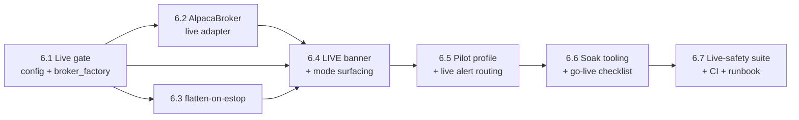

# Epic 6 — Live-Trading Gate & Soak

> **Goal:** Let CLAV place **real-money** orders — safely, deliberately, and only after a clean
> multi-day paper soak and a signed-off go-live checklist. Every prior epic was paper-only by
> construction; Epic 6 opens the one door that was bolted shut since Epic 1 — a live `Broker`
> behind a **two-key gate** — and makes the fact that real money is at stake impossible to
> miss: a persistent **LIVE** banner, live-escalated alerts, and `flatten-on-estop` that
> actually closes positions. It ships the **capital-capped live pilot** the roadmap calls for,
> not an uncapped live system.
>
> This is Phase 6 of the [roadmap](../12-roadmap.md). It implements the live-trading gate and
> fail-closed matrix in [06 — Safety & Risk](../06-safety-and-risk.md) §6–7 and the live
> deployment posture in [09 — Deployment](../09-deployment.md). It adds **no new intelligence
> and no new risk rules** — the Epic-2 pipeline and Epic-3 analyst are unchanged; Epic 6 only
> changes *which broker the already-vetted orders reach* and *how loudly the system says it's
> live.*

## Resolved design decisions

Open questions at scoping time, settled here so the stories are unambiguous. Revisit explicitly
if the product direction changes.

1. **Live is behind a two-key gate, fail-closed — never a silent default.** `mode: live` alone
   is not enough; it requires `mode: live` **and** `i_understand_live_trading: true` **and** the
   live Alpaca credentials present. Any one missing ⇒ the process **refuses to start** with a
   clear error, never silently falls back to paper (a system the operator *thinks* is paper but
   is actually live, or vice-versa, is the worst failure here). `broker_factory` stays the single
   switch (Story 1.6); the Epic-1 hard guards in `config.py` (`_guard_live_mode`) and
   `broker_factory` (`NotImplementedError`) are **replaced** by this gate, not loosened into an
   always-on path.
2. **The live `AlpacaBroker` shares PaperBroker's mapping, differing only in endpoint + keys.**
   PaperBroker already maps CLAV `OrderRequest`↔Alpaca and normalizes statuses/errors; the live
   adapter reuses that logic (extract a shared base or mixin) and differs **only** in the base
   URL (live vs. `paper-api`) and which key pair it authenticates with. Rejected: a forked copy —
   two order-mapping code paths is exactly the kind of drift that causes a live-only bug paper
   never caught.
3. **`flatten-on-estop` routes through the existing exit path, not a new bypass.** When
   `flatten_on_estop: true` and the emergency stop trips, open positions are closed as forced
   market SELLs through the same `StopMonitor`→`ExecutionEngine` path a stop-loss uses:
   idempotent `client_order_id`, a persisted `risk_evaluation` (`notes.source="flatten_on_estop"`,
   an unconditional approval), full audit trail. Exits are **always** allowed under an estop
   (that invariant already holds), so flatten is just a forced batch of them — no rule-pipeline
   bypass beyond the one exits already have. Default stays `false`; enabling it is an operator
   choice.
4. **"Live" is surfaced everywhere the operator looks.** A persistent **LIVE** banner on every
   dashboard page, a `mode` field in `/health`, a `mode=live` stamp on every structured log line,
   and CRITICAL-severity routing for live-money alerts. A live system must never *look* like a
   paper one at a glance — this is a safety feature, not cosmetics.
5. **The pilot is capital-capped by config, not by new code.** Live inherits every Epic-2 risk
   knob; a shipped **pilot profile** (`config.pilot.example.yaml`) just sets them far tighter
   (small `max_position_value`, low `max_daily_loss_pct`, a short watchlist). No new limit
   mechanism — the existing 15-rule pipeline already enforces caps; the pilot is a *values*
   choice the checklist mandates for first live capital.
6. **Soak + go-live is a documented checklist and a soak-report query, not automation.** The
   roadmap's exit criteria ("clean soak… reviewed go-live checklist signed off") is a **human**
   gate. Epic 6 ships a `clav-ctl soak-report` (dup-order scan, unhandled-error count, health
   summary over a window) and a checklist doc; a person reads them and flips the config. CLAV does
   not self-promote from paper to live.
7. **Live changes nothing upstream of the broker.** No new risk rule, no analyst change, no
   decision-engine change. If a story finds itself editing `domain/risk` or `domain/decision`,
   it has left Epic 6's scope — the whole point is that the *same* vetted order stream reaches a
   different broker.

## Where Epic 5 left off

- **`mode=live` is hard-blocked in two places.** `Settings._guard_live_mode` raises on
  `mode: live`, and `broker_factory` raises `NotImplementedError` for it. Both must become the
  real gate (decision #1). `i_understand_live_trading` and `flatten_on_estop` config fields
  already exist but are **inert** — the live guard rejects before the former is consulted, and
  nothing reads the latter.
- **No live `Broker`.** `integrations/` has `PaperBroker` (Alpaca paper endpoint), `DryRunBroker`,
  and the `Broker` ABC (whose docstring already says "a live AlpacaBroker adapter is Epic 6").
- **Emergency stop freezes but never flattens.** Manual e-stop (`clav-ctl`) and the auto
  daily-loss breaker both set `system_control.emergency_stop`, which vetoes new entries; open
  positions are left alone (README's risk table flags `flatten_on_estop` as "no effect").
- **The dashboard is paper-only** — no LIVE banner, no `mode` surfaced in `/health` or logs.
- **Everything the live path needs downstream already exists and is proven**: the full risk
  pipeline (Epic 2), idempotent execution + reconciliation (Epic 1), the alerter (Epic 4), and
  the deployment/systemd units (Epic 1/Story 1.14, pending the hardware verification the README
  still notes).

## Epic-level definition of done

- **A live `AlpacaBroker`** (`integrations/alpaca_broker.py`) implements `Broker` against Alpaca's
  live endpoint, sharing PaperBroker's order/status/error mapping (decision #2), constructed
  **only** by `broker_factory` when the live gate passes.
- **The live gate** (decision #1): `mode: live` requires `i_understand_live_trading: true` and
  live credentials, else a clear startup refusal — verified fail-closed in both directions
  (live-without-flag refuses; paper-with-flag stays paper). The Epic-1 guards are replaced, not
  bypassed.
- **`flatten-on-estop`** (decision #3): with the flag on, tripping the e-stop closes every open
  position via the existing idempotent exit path, each with a persisted `risk_evaluation` and
  audit row; with the flag off, behavior is unchanged (freeze only). Exits remain always-allowed.
- **LIVE is unmissable** (decision #4): a persistent banner on the dashboard, `mode` in `/health`,
  a `mode` field on structured logs, and live-money alert conditions routed CRITICAL.
- **A capital-capped pilot profile** (decision #5): `config.pilot.example.yaml` with tight caps
  and a short watchlist, referenced by the go-live checklist as the mandatory first-live config.
- **Soak tooling + checklist** (decision #6): `clav-ctl soak-report` summarizes a window
  (duplicate `client_order_id`s → must be zero, unhandled-error count, health/liveness, daily-loss
  headroom), and a **go-live checklist** doc gates real capital behind a human sign-off.
- **Still safe on a fresh clone**: default `mode: paper`, live unreachable without the deliberate
  two-key opt-in; no test, CI job, or default config ever selects live.
- **CI**: a live-gate fail-closed suite (every accept/refuse combination), an `AlpacaBroker`
  mapping suite (mocked `TradingClient`, no live network — same pattern as PaperBroker's tests),
  a flatten-on-estop property suite (estop ⇒ all positions closed, idempotent, audited; flag-off
  ⇒ untouched), and a LIVE-surfacing smoke test. **No CI job runs against a live account.**

## Epic-level acceptance demo

On a seeded DB, show the gate fail-closed: `mode: live` with `i_understand_live_trading: false`
refuses to start; add the flag but drop the live keys — still refuses; set all three — starts,
and `/health` + every log line now read `mode=live` with a **LIVE** banner on the dashboard.
Point it at the **pilot profile** and show the tight caps in effect (a proposed order shrunk by
`max_position_value`). Open positions, trip the e-stop with `flatten_on_estop: true`, and watch
every position close as an audited, idempotent market SELL — then flip the flag off, re-trip, and
watch positions held (freeze only). Trip a live-money alert condition and see it routed CRITICAL.
Run `clav-ctl soak-report` over the seeded window and read the zero-dup-orders / zero-unhandled /
green-health summary the go-live checklist requires. Show the whole thing with **no live account
touched in CI** and the live-gate + broker-mapping + flatten suites green.

## Out of scope (deferred)

- **Multi-broker routing, non-Alpaca venues, crypto** → **Phase 7 / [Future Expansion](../14-future-expansion.md)**.
- **Any new risk rule, analyst, or decision-engine change** (decision #7) — Epic 6 is broker +
  visibility only.
- **Automated paper→live promotion** — the go-live gate is a human sign-off (decision #6).
- **Real hardware soak execution** — Epic 6 ships the tooling + checklist; the multi-day soak and
  live pilot are an *operational* exercise the operator runs (like the Story-1.14 Pi verification
  the README already defers).

---

## Story map & sequencing

Rough size: **~20 points**. Critical path: 6.1 → 6.2 → 6.4 → 6.6 → 6.7. Stories 6.3 and 6.5 are
parallelizable after 6.1/6.4. **6.1 must land first** — the gate is what every other story builds
on, and getting it fail-closed is the whole epic's safety hinge.

---

## Story 6.1 — Live gate: config + `broker_factory` · 3 pts
**As a** stakeholder **I want** live mode reachable only behind a deliberate, fail-closed
two-key gate **so that** real money is never traded by accident or by a partial misconfiguration.

**Acceptance criteria**
- `Settings._guard_live_mode` is replaced: `mode: live` is allowed **iff** `i_understand_live_trading:
  true`; otherwise a clear `ConfigError` naming the missing flag. `mode: dryrun|paper` unchanged.
- `broker_factory` gains the live branch, constructing the Story-6.2 `AlpacaBroker` **only** when
  live credentials are present; missing keys ⇒ refuse (never fall back to paper/dryrun).
- Live credentials are a **separate** key pair from paper (`.env` only, never YAML) so a paper key
  can never accidentally authenticate a live session.
- Tests: `live + flag + keys` → live broker; `live + no flag` → refuse; `live + flag + no keys` →
  refuse; `paper + flag` → paper (flag is inert without `mode: live`); fresh clone default stays
  paper.

**Tasks:** replace `_guard_live_mode`; live-credential config fields; `broker_factory` live branch
(guarded); fail-closed config tests.

---

## Story 6.2 — Live `AlpacaBroker` adapter · 3 pts
**As a** stakeholder **I want** a live broker that reuses the proven paper mapping **so that** a
live-only order bug can't hide in a forked code path.

**Acceptance criteria**
- `integrations/alpaca_broker.py` implements `Broker` against Alpaca's **live** trading endpoint,
  sharing PaperBroker's `OrderRequest`↔Alpaca mapping, status normalization, and `APIError`
  handling (extract a shared base/helper; no copy-paste divergence — decision #2).
- The only differences from PaperBroker are the base URL and the credential pair; idempotent
  `client_order_id` submission and reconciliation are identical (they're what Epic 1 already
  guarantees).
- Tests reuse PaperBroker's mocked-`TradingClient` approach (no live network, same as
  `test_paper_broker.py`): submit/cancel/get_positions/get_account map correctly; a transient
  `APIError` retries, a permanent one surfaces.

**Tasks:** factor shared Alpaca mapping out of PaperBroker; `AlpacaBroker` (live endpoint);
wire into `broker_factory`; mocked-client mapping tests.

---

## Story 6.3 — `flatten-on-estop` · 3 pts
**As an** operator **I want** the emergency stop to optionally close all open positions **so that**
a real-money panic button actually gets me flat, not just frozen.

**Acceptance criteria**
- When `flatten_on_estop: true` and the e-stop is set (manual or auto daily-loss), each open
  position is closed as a forced market SELL through the existing `StopMonitor`/`ExecutionEngine`
  exit path — idempotent `client_order_id`, a persisted `risk_evaluation`
  (`notes.source="flatten_on_estop"`, unconditional approval), and an audit row.
- With `flatten_on_estop: false` (default), behavior is unchanged: e-stop freezes new entries,
  positions untouched.
- Flatten is safe under a tripped estop (exits are always allowed) and idempotent across repeated
  cycles — a position already being flattened isn't double-sold (the open-sell duplicate guard
  already covers this).
- Tests (property): estop + flag ⇒ every position closed exactly once, each audited; flag off ⇒
  positions held; a partially-flattened state re-runs without duplicate orders.

**Tasks:** read `flatten_on_estop` at the estop-check point; drive `StopMonitor`/exit path for
open positions on the trip edge; `risk_evaluation` source tag; idempotency + flag-off property
tests.

---

## Story 6.4 — LIVE banner + `mode` surfacing · 2 pts
**As an** operator **I want** the live/paper mode impossible to miss **so that** I always know
whether real money is at stake before I touch a control.

**Acceptance criteria**
- A persistent **LIVE** banner on every `clav-web` page when `mode: live` (visually loud,
  inline-CSS, no new build step); absent in paper/dryrun.
- `mode` is added to the `GET /health` payload and stamped on every structured log line
  (extending the existing logging context).
- The banner reads from the same config the trading loop uses — it can never show "paper" while
  the broker is live (single source of truth).
- Tests: `/health` reports the mode; a live-config app renders the banner, a paper one doesn't;
  logs carry the mode field.

**Tasks:** live-config test fixture; banner partial in `base.html` gated on mode; `mode` in
`/health` + log context; render/payload tests.

---

## Story 6.5 — Capital-capped pilot profile + live alert routing · 2 pts
**As a** stakeholder **I want** first live capital tightly capped and live-money alerts escalated
**so that** the pilot's downside is small and I'm paged the instant anything's wrong with real
money.

**Acceptance criteria**
- `config/config.pilot.example.yaml`: a committed, fully-commented live-pilot profile — small
  `max_position_value`, low `max_daily_loss_pct`/`max_drawdown_pct`, a short watchlist,
  `flatten_on_estop: true` — enforced entirely by the existing Epic-2 rules (no new limit code).
- Live-money alert conditions (e-stop tripped, daily-loss cap hit, broker auth failure,
  reconciliation failure) route at **CRITICAL** when `mode: live`, so they page immediately rather
  than batch.
- Tests: the pilot profile loads and its caps actually shrink/veto a would-be-larger order; live
  mode escalates the alert severity that paper would have batched.

**Tasks:** pilot example config; mode-aware alert severity in the alert-hook/`HealthMonitor` wiring;
caps-in-effect + escalation tests.

---

## Story 6.6 — Soak tooling + go-live checklist · 3 pts
**As a** stakeholder **I want** a soak report and a written go-live gate **so that** live capital
is only ever enabled after a clean, human-reviewed paper soak.

**Acceptance criteria**
- `clav-ctl soak-report` summarizes a time window from the DB: duplicate `client_order_id` count
  (**must be 0**), unhandled-error/failed-cycle count, health/liveness summary, and daily-loss
  headroom — read-only, bounded, no live calls.
- A **go-live checklist** doc (referenced from docs/09 and the README runbook): run the soak,
  read the report, confirm the pilot profile, confirm live keys are separate paper-vs-live, sign
  off, *then* flip `mode: live` + `i_understand_live_trading: true`.
- The report renders cleanly on an empty/short window (no divide-by-zero, no crash).
- Tests: dup-order detection flags a seeded duplicate and passes a clean window; error/cycle
  counts correct; empty-window renders.

**Tasks:** `soak-report` CLI query; dup/error/health aggregation (bounded); go-live checklist doc;
report tests.

---

## Story 6.7 — Live-safety invariant suite, CI & runbook · 3 pts
**As a** stakeholder **I want** the live path proven fail-closed and documented **so that** Epic 6
is as trustworthy as every paper epic before it.

**Acceptance criteria**
- **Live-gate fail-closed suite:** every accept/refuse combination of `mode`×`flag`×`keys`
  asserted; a property test that **no** default/test/example config except the pilot ever selects
  live, and the pilot only with the flag.
- **Flatten-on-estop invariants** (from 6.3) and **AlpacaBroker mapping** (from 6.2) are gathered
  into the one live-safety file a reviewer opens (mirroring Epic 3's chaos-suite file).
- **No CI job authenticates a live account** — a guard test asserts the test suite never
  constructs an `AlpacaBroker` against a real endpoint (mocked client only).
- CI gate: the live-safety suite is required; coverage stays high on `alpaca_broker.py`, the gate,
  and the flatten path (matching the `domain/risk` bar).
- README/docs: a **Phase 6 runbook** — the go-live checklist, how the two-key gate works, reading
  a soak report, what LIVE surfacing looks like, and how to roll back to paper — plus the
  `config.pilot.example.yaml` walkthrough.

**Tasks:** live-gate property suite; no-live-network guard test; gather flatten/broker invariants;
CI wiring; README Phase-6 runbook + pilot walkthrough.

---

## Dependencies & risks

- **Hard dependency on Epics 1–4.** Epic 6 reuses idempotent execution + reconciliation (Epic 1),
  the full risk pipeline that caps every order (Epic 2), the alerter (Epic 4), and PaperBroker's
  mapping (Epic 1). All exist; Epic 6 is unblocked. It must **not** pull Phase-7 multi-broker
  work forward (Out of scope).
- **Real money — the whole epic is the risk.** The two-key fail-closed gate (6.1), the
  capital-capped pilot (6.5), and the human go-live sign-off (6.6) are all load-bearing: the
  failure mode here isn't a crash, it's *quietly trading live when the operator thought it was
  paper*, or with uncapped size. Every ambiguous default resolves to paper/refuse.
- **No live account in this environment.** Like PaperBroker, `AlpacaBroker` is tested against a
  mocked `TradingClient`; a real live pilot can only be validated on the operator's own funded
  account, which the go-live checklist (6.6) governs. CI must never hold or use a live key — 6.7's
  guard test enforces this.
- **Flatten-on-estop is a real-money action that fires under duress.** It must be idempotent and
  audited (6.3) so a crash mid-flatten, or a repeated trip, never double-sells or leaves an
  untracked exit. It rides the exit path that already guarantees this rather than a new one.
- **Mode ambiguity is itself a hazard.** Surfacing LIVE everywhere (6.4) from the single config
  source of truth is a safety control, not decoration — a dashboard that shows "paper" over a live
  broker would be worse than no dashboard.
- **Carried invariants hold.** No SPA/CDN (the banner is inline-CSS); two processes / one DB;
  secrets `.env`-only (live keys included); and — decision #7 — nothing upstream of the broker
  changes, so the Epic-2 safety proofs and Epic-3 degradation proofs still cover the live path
  unchanged.
